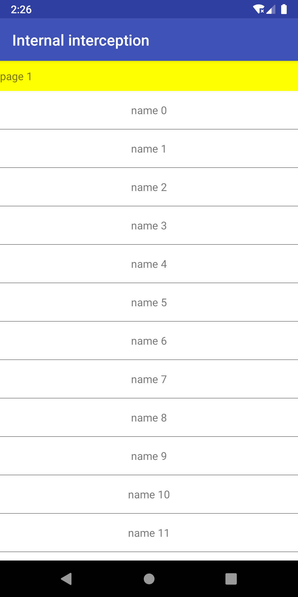

- [Android 滑动冲突](#android-滑动冲突)
  - [外部拦截法](#外部拦截法)
  - [内部拦截法](#内部拦截法)
  - [总结](#总结)
## Android 滑动冲突

Android滑动冲突的一般分为三种，第一种是滑动方向不是同向的，比如外部是水平滑动，内部是垂直滑动，例子如ViewPager内部嵌套RecycleView，第二种是滑动方向是相同的，比如外部是垂直滑动，内部也是垂直滑动的，例子如
ScrollView内部嵌套ListView，第三种是两者的嵌套，比如外层是水平滑动，中间层是垂直滑动，内层是水平滑动，例子如商品App中的首页Banner, Banner是水平滑动布局，Banner的外层是垂直滑动的列表，列表的外层是水平滑动的ViewPager。

滑动冲突的解决方法一般有两种，一种是外部拦截法，一种是内部拦截法。这两种拦截方法都是基于事件传递机制来实施的。事件的传递机制伪代码如下：
```java
dispatchTouchEvent(){
    if (onInterceptTouchEvent()){
        onTouchEvent()
    } else {
      childView.dispatchTouchEvent()
    }
}
```

外部拦截法就是利用父容器在OnInterceptTouchEvent()中对ACTION_MOVE事件进行视具体需求来拦截处理（有需要就拦截，不需要就不拦截），其它的TOUCH_DOWN和TOUCH_UP事件都不做拦截。如果拦截了ACTION_DOWN时间，那么后面同一序列事件都不会再次调用了OnInterceptTouchEvent()方法，那么就没法进行其他的逻辑处理了，比如是否进行事件拦截操作，没有对父容器的子控件进行事件派发的机会了。对于ACTION_UP事件，一般不做拦截，返回false，因为这里分两种情况需要考虑，一种是如果外部拦截了，那么我不用管子控件，可以根据父容器是否需要点击事件来处理，一：需要，那么我就必须返回true, 二：不需要，那么就返回false。 一种是外部不拦截，那么我就需要管子控件，那么事件需要传递给子控件，那么就需要在ACTION_UP的时候，返回false。总的来说，一般在ACTION_UP的时候返回false。

外部拦截法伪代码
```java
//  XXVeiwGroup.java

boolea onInterceptTouchEvent(MotionEvent event){
     boolean intercepted = false;
     switch(event.getAction){
         case ACTION_DOWN:
               intercepted = false;
          break;
         case ACTION_MOVE:
            if (父容器需要拦截事件) {
               intercepted = true;
            } else {
               intercepted = false;
            }
          break; 
         case ACTION_UP:
              intercepted = false; 
          break;  
     }
     return intercepted;
}

```

内部拦截法就是在子控件进行事件派发的时候进行拦截处理，同时也需要父容器的拦截方法进行配合。伪代码如下：

```java

// xxChildView.java 父容器控件
boolean dispatchTouchEvent(MotionEvent event){
    switch(event.getAction) {
       case ACTION_DOWN:
          // 不允许父容器进行事件拦截
          getParentView().requestDisallowInterceptTouchEvent(true);
          break;
       case ACTION_MOVE:
          if (父容器需要拦截事件) {
             // 允许父容器拦截事件
             getParentView().requestDisallowInterceptTouchEvent(false); 
          }
          break;
       case ACTION_UP:
          break;
    }
    return super.dispatchTouchEvent(event);
}

// xxParentView.java 子控件
boolean onInterceptTouchEvent(MotionEvent event){
    if (event.getAction()==ACTION_DOWN){
        return false;
    } else {
        // 这块基本上就返回true 不然无法真正实现父容器对事件的拦截 
        return true;
    }
}
```

### 外部拦截法
外部拦截法相比较内部拦截法，比较简单，我们以一个外部是一个横向滑动ViewGroup，内部是三个列表ListView，这种组合一般肯定会存在滑动冲突问题。手指在横向滑动的时候，事件从父容器派发到ListView上，水平横向滑动和垂直滑动就冲突了，因为正常的用户体验肯定是一个方向上的流畅滑动。运行结果如下：



解决问题的例子代码如下：

外部横向滑动ViewGroup代码
```java
/**
 * 外部拦截法
 *
 * 重写父容器的OnInterceptTouchEvent方法
 *
 * 当需要父容器进行拦截的时候就拦截 返回true 其他情况一般返回false
 * 不进行拦截 把事件交给子容器区处理
 *
 */
public class HorizontalScrollViewEx extends ViewGroup {

    private static final String TAG = "HorizontalScrollViewEx";
    private int mChildrenSize;
    private int mChildWidth;
    private int mChildIndex;

    //记录上次滑动的坐标
    private int mLastX = 0;
    private int mLastY = 0;

    // 分别记录上次滑动的坐标（onInterceptTouchEvent）
    private int mLastXIntercept = 0;
    private int mLastYIntercept = 0;

    private Scroller mScroller;
    private VelocityTracker mVelocityTracker;

    public HorizontalScrollViewEx(Context context) {
        super(context);
        init();
    }

    public HorizontalScrollViewEx(Context context, AttributeSet attrs) {
        super(context, attrs);
        init();
    }

    private void init() {
        mScroller = new Scroller(getContext());
        mVelocityTracker = VelocityTracker.obtain();
    }


    @Override
    public boolean onInterceptTouchEvent(MotionEvent event) {
        Log.e(TAG, "onInterceptTouchEvent: start ");
        boolean intercepted = false;
        int x = (int) event.getX();
        int y = (int) event.getY();

        switch (event.getAction()) {
            case MotionEvent.ACTION_DOWN:
                intercepted = false;
                /*
                 * 如果滑动动画还没结束，我们就按下结束的按钮，那我们就该结束该动画。
                 * 目的是为了优化滑动体验。
                 * 如果用户正在进行水平滑动，在滑动停止前用户迅速转化为竖直滑动，导致
                 * 界面在水平方向滑动至终点从而处于一种中间状态，为了避免这种状态，
                 * 用户正在水平滑动时候，下一个序列的事件仍然交给父容器。
                 *
                 * */
                if (!mScroller.isFinished()) {
                    mScroller.abortAnimation();
                    return true;
                }
                break;
            case MotionEvent.ACTION_MOVE:
                int deltaX = x - mLastXIntercept;
                int deltaY = y - mLastYIntercept;

                if (Math.abs(deltaX) > Math.abs(deltaY)) {
                    // 水平滑动距离差 > 竖直滑动距离差
                    intercepted = true;
                    Log.e(TAG, "onInterceptTouchEvent: true");
                } else {
                    // 水平滑动距离差 < 竖直滑动距离差
                    intercepted = false;
                }
                break;
            case MotionEvent.ACTION_UP:
                intercepted = false;
                break;
        }
        mLastX = x;
        mLastY = y;
        mLastXIntercept = x;
        mLastYIntercept = y;
        return intercepted;
    }

    @Override
    public boolean onTouchEvent(MotionEvent event) {
        Log.e(TAG, "onTouchEvent: "+event.getAction());
        // 表示追踪当前点击事件的速度
        mVelocityTracker.addMovement(event);
        int x = (int) event.getX();
        int y = (int) event.getY();
        switch (event.getAction()) {
            case MotionEvent.ACTION_DOWN:
                if (!mScroller.isFinished()) {
                    mScroller.abortAnimation();
                }
                break;
            case MotionEvent.ACTION_MOVE:
                int deltaX = x - mLastX;
                int deltaY = y - mLastY;
                scrollBy(-deltaX, 0);
                break;
            case MotionEvent.ACTION_UP:
                /*
                 *  表示计算速度，比如：时间间隔为1000ms,在1秒内,
                 *  手指在水平方向从左向右滑过100像素，那么水平速度就是100；
                 *  计算速度+获取速度---三部曲
                 *  1. mVelocityTracker.computeCurrentVelocity(1000);
                 *  2. float xVelocity = mVelocityTracker.getXVelocity(); // 获取水平方向的滑动速度
                 *  3. float yVelocity = mVelocityTracker.getYVelocity(); // 获取垂直方向的滑动速度
                 *
                 *  注意：这里的速度是指一段时间内手指滑过的像素数，
                 *
                 *
                 * */
                int scrollX = getScrollX();
                int scrollToChildIndex = scrollX / mChildWidth;
                mVelocityTracker.computeCurrentVelocity(1000);
                float xVelocity = mVelocityTracker.getXVelocity();
                if (Math.abs(xVelocity) >= 50) {
                    mChildIndex = xVelocity > 0 ? mChildIndex - 1 : mChildIndex + 1;
                } else {
                    mChildIndex = (scrollX + mChildWidth / 2) / mChildWidth;
                }
                mChildIndex = Math.max(0, Math.min(mChildIndex, mChildrenSize - 1));
                int dx = mChildIndex * mChildWidth - scrollX; // 缓慢地滑动到目标的X坐标
                smoothScrollBy(dx, 0);
                // 对速度跟踪进行回收
                mVelocityTracker.clear();
                break;
            default:
                break;
        }
        return true;
    }

    @Override
    protected void onMeasure(int widthMeasureSpec, int heightMeasureSpec) {
        super.onMeasure(widthMeasureSpec, heightMeasureSpec);
        int measureWidth = 0;
        int measureHeight = 0;
        final int childCount = getChildCount();
        measureChildren(widthMeasureSpec, heightMeasureSpec);

        int widthSpaceSize = MeasureSpec.getSize(widthMeasureSpec);
        int widthSpecMode = MeasureSpec.getMode(widthMeasureSpec);

        int heightSpaceSize = MeasureSpec.getSize(heightMeasureSpec);
        int heightSpecMode = MeasureSpec.getMode(heightMeasureSpec);

        if (childCount == 0) {
            setMeasuredDimension(0, 0);
        } else if (heightSpecMode == MeasureSpec.AT_MOST) {
            final View childView = getChildAt(0);
            measureHeight = childView.getMeasuredHeight();
            setMeasuredDimension(widthSpaceSize, childView.getMeasuredHeight());
        } else if (widthSpecMode == MeasureSpec.AT_MOST) {
            final View childView = getChildAt(0);
            measureWidth = childView.getMeasuredWidth() * childCount;
            setMeasuredDimension(measureWidth, heightSpaceSize);
        } else {
            final View childView = getChildAt(0);
            measureWidth = childView.getMeasuredWidth() * childCount;
            measureHeight = childView.getMeasuredHeight();
            setMeasuredDimension(measureWidth, measureHeight);
        }
    }


    @Override
    protected void onLayout(boolean changed, int l, int t, int r, int b) {
        int childLeft = 0;
        final int childCount = getChildCount();
        mChildrenSize = childCount;
        for (int i = 0; i < childCount; i++) {
            final View childView = getChildAt(i);
            if (childView.getVisibility() != View.GONE) {
                final int childWidth = childView.getMeasuredWidth();
                mChildWidth = childWidth;
                childView.layout(childLeft, 0, childLeft + childWidth,
                        childView.getMeasuredHeight());
                childLeft += childWidth;
            }
        }
    }

    private void smoothScrollBy(int dx, int dy) {
        mScroller.startScroll(getScrollX(), 0, dx, dy, 500);
        invalidate();
    }

    /**
     * computeScroll: 主要功能是计算拖动的位移量，更新背景
     * 通常是用mScroller记录、计算View滚动的位置，再重写View的computeScroll()
     * 完成实际的滚动
     */
    @Override
    public void computeScroll() {
        if (mScroller.computeScrollOffset()) {
            scrollTo(mScroller.getCurrX(), mScroller.getCurrY());
            postInvalidate();
        }
    }

    @Override
    protected void onDetachedFromWindow() {
        mVelocityTracker.recycle();
        super.onDetachedFromWindow();
    }
}
```
在布局文件中使用
```java
<?xml version="1.0" encoding="utf-8"?>
<LinearLayout xmlns:android="http://schemas.android.com/apk/res/android"
    android:layout_width="match_parent"
    android:layout_height="match_parent"
    android:orientation="vertical">

   <com.lucky.androidlearn.widget.common.scrollconflict.HorizontalScrollViewEx
       android:id="@+id/container"
       android:layout_width="wrap_content"
       android:layout_height="match_parent">

   </com.lucky.androidlearn.widget.common.scrollconflict.HorizontalScrollViewEx>

</LinearLayout>
```

在Activity中使用自定义横向滑动ViewGroup
```java
/**
 * 外部拦截法
 */
public class ScrollConflictDemo1Activity extends AppCompatActivity {

    HorizontalScrollViewEx mListContainer;

    @Override
    protected void onCreate(@Nullable Bundle savedInstanceState) {
        super.onCreate(savedInstanceState);
        setContentView(R.layout.activity_scroll_conflict_demo1);
        initView();
    }

    private void initView() {
        LayoutInflater inflater = getLayoutInflater();
        mListContainer = (HorizontalScrollViewEx) findViewById(R.id.container);
        final int screenWidth = AppScreenMgr.getScreenWidth(this);
        final int screenHeight = AppScreenMgr.getScreenHeight(this);

        for (int i = 0; i < 3; i++) {
            ViewGroup layout = (ViewGroup) inflater.inflate(R.layout.content_layout,
                    mListContainer, false);
            layout.getLayoutParams().width = screenWidth;
            TextView textView = layout.findViewById(R.id.title);
            textView.setText("page " + (i + 1));
            layout.setBackgroundColor(Color.rgb(255 / (i + 1), 255 / (i + 1), 0));
            createList(layout);
            mListContainer.addView(layout);
        }

    }

    private void createList(ViewGroup layout) {
        ListView listView = layout.findViewById(R.id.list);
        ArrayList<String> datas = new ArrayList<>();
        for (int i = 0; i < 50; i++) {
             datas.add("name "+i);
        }

        ArrayAdapter<String> adapter = new ArrayAdapter<>(this,
                R.layout.item_scroll_conflict, R.id.name, datas) ;

        listView.setAdapter(adapter);
        listView.setOnItemClickListener(new AdapterView.OnItemClickListener() {
            @Override
            public void onItemClick(AdapterView<?> parent, View view, int position, long id) {
                AppToastMgr.shortToast(ScrollConflictDemo1Activity.this,
                        "click item  "+position);
            }
        });
    }
}
```

### 内部拦截法
内部拦截法比较复杂，涉及到子控件和父容器的处理，子控件需要重写dispatchTouchEvent()方法，父容器需要重写onInterceptTouchEvent()方法，同样也是上面的例子，但是我们使用内部拦截法来进行滑动事件的冲突解决。

子控件ListView
```java
public class ListViewEx extends ListView {

    private static final String TAG = "ListViewEx";

    //分别记录上次滑动的坐标
    private int mLastX = 0;
    private int mLastY = 0;
    private HorizontalScrollViewEx2 mHorizontalScrollViewEx2;

    public ListViewEx(Context context) {
        super(context);
    }

    public ListViewEx(Context context, AttributeSet attrs) {
        super(context, attrs);
    }

    public ListViewEx(Context context, AttributeSet attrs, int defStyleAttr) {
        super(context, attrs, defStyleAttr);
    }


    public void setHorizontalScrollViewEx2(HorizontalScrollViewEx2 horizontalScrollViewEx2) {
        mHorizontalScrollViewEx2 = horizontalScrollViewEx2;
    }


    @Override
    public boolean dispatchTouchEvent(MotionEvent event) {
        int x = (int) event.getX();
        int y = (int) event.getY();

        switch (event.getAction()) {
            case MotionEvent.ACTION_DOWN:
                Log.e(TAG, "dispatchTouchEvent: ACTON_DOWN");
                // 不允许父容器进行拦截 那么就是从DOW事件开始到UP事件结束 就不会再次调用父容器的onInterceptTouchEvent方法
                // 除非 再次调用 parentView.requestDisallowInterceptTouchEvent(false); 才会调用父容器的onInterceptTouchEvent()
                // 这个不拦截 针对的是整个一个完整的事件序列 即从Down时间开始到Up事件结束
                mHorizontalScrollViewEx2.requestDisallowInterceptTouchEvent(true);
                break;
            case MotionEvent.ACTION_MOVE:
                Log.e(TAG, "dispatchTouchEvent: ACTON_MOVE");
                int deltaX = x - mLastX;
                int deltaY = y - mLastY;
                Log.e(TAG, "dispatchHoverEvent: dx " + deltaX + "  dy " + deltaY);
                if (Math.abs(deltaX) > Math.abs(deltaY)) {
                    // 允许父容器进行拦截 那么就会重新调用父容器的onInterceptTouchEvent事件
                    // 至于真的是否做到拦截 那不是由这句disallow来决定的，而是由父容器的onInterceptTouchEvent方法
                    // 怎么处理MOVE事件的
                    mHorizontalScrollViewEx2.requestDisallowInterceptTouchEvent(false);
                }
                break;
            case MotionEvent.ACTION_UP:
                Log.e(TAG, "dispatchTouchEvent: ACTON_UP");
                break;
        }
        mLastX = x;
        mLastY = y;
        return super.dispatchTouchEvent(event);
    }
}
```

父容器横向滑动ViewGroup
```java
/**
 * 内部拦截法 和外部拦截相比较，只需要考虑修改onInterceptTouchEvent这部分的代码，其他的不用动。
 */
public class HorizontalScrollViewEx2 extends ViewGroup {

    private static final String TAG = "HorizontalScrollViewEx";
    private int mChildrenSize;
    private int mChildWidth;
    private int mChildIndex;

    //记录上次滑动的坐标
    private int mLastX = 0;
    private int mLastY = 0;

    // 分别记录上次滑动的坐标（onInterceptTouchEvent）
    private int mLastXIntercept = 0;
    private int mLastYIntercept = 0;

    private Scroller mScroller;
    private VelocityTracker mVelocityTracker;

    public HorizontalScrollViewEx2(Context context) {
        super(context);
        init();
    }

    public HorizontalScrollViewEx2(Context context, AttributeSet attrs) {
        super(context, attrs);
        init();
    }

    private void init() {
        mScroller = new Scroller(getContext());
        mVelocityTracker = VelocityTracker.obtain();
    }


    @Override
    public boolean onInterceptTouchEvent(MotionEvent event) {
        boolean intercepted = false;
        int x = (int) event.getX();
        int y = (int) event.getY();
        int action = event.getAction();
        if (action == MotionEvent.ACTION_DOWN) {
            Log.e(TAG, "onInterceptTouchEvent: ACTION_DOWN");
            mLastX = x;
            mLastY = y;
            if (!mScroller.isFinished()) {
                mScroller.abortAnimation();
                return true;
            }
            return false; // 表示不拦截事件 后面的MOVE，UP事件是可以继续传递过来的
            //return true; // 表示onInterceptTouchEvent就DOWN结束了 不会再次调用onInterceptTouchEvent() 除非重新来一个事件序列 但是要注意仅仅是不再调用，在OnTouchEvent事件中 属于这个事件序列的MOVE，UP事件是依旧能传递过来的，不要搞混了。
        } else {
            if (action == MotionEvent.ACTION_MOVE) {
                Log.e(TAG, "onInterceptTouchEvent: ACTION_MOVE");
                // 下面的讨论是基于正常情况下的，即事件能够传递到子控件的时候
                // return false 这样就表示事件序列仍然可以继续（后面的MOVE,UP事件是可以继续通过onInterceptTouchEvent方法来继续传递过来的）
                //return true 表示这个事件序列就到此结束了 后面属于这个事件序列的MOVE，UP事件是不会继续传递过来的
                //这样就可能会造成一个问题 就是UP事件传递不过来 那么点击时间也就不能成立了 无法响应
            } else if (action == MotionEvent.ACTION_UP) {
                Log.e(TAG, "onInterceptTouchEvent: ACTION_UP");
            }
            return true;
        }
    }

    @Override
    public boolean onTouchEvent(MotionEvent event) {
        // 表示追踪当前点击事件的速度
        mVelocityTracker.addMovement(event);
        int x = (int) event.getX();
        int y = (int) event.getY();
        switch (event.getAction()) {
            case MotionEvent.ACTION_DOWN:
                if (!mScroller.isFinished()) {
                    mScroller.abortAnimation();
                }
                break;
            case MotionEvent.ACTION_MOVE:
                int deltaX = x - mLastX;
                int deltaY = y - mLastY;
                scrollBy(-deltaX, 0);
                break;
            case MotionEvent.ACTION_UP:
                /*
                 *  表示计算速度，比如：时间间隔为1000ms,在1秒内,
                 *  手指在水平方向从左向右滑过100像素，那么水平速度就是100；
                 *  计算速度+获取速度---三部曲
                 *  1. mVelocityTracker.computeCurrentVelocity(1000);
                 *  2. float xVelocity = mVelocityTracker.getXVelocity(); // 获取水平方向的滑动速度
                 *  3. float yVelocity = mVelocityTracker.getYVelocity(); // 获取垂直方向的滑动速度
                 *
                 *  注意：这里的速度是指一段时间内手指滑过的像素数，
                 *
                 *
                 * */
                int scrollX = getScrollX();
                int scrollToChildIndex = scrollX / mChildWidth;
                mVelocityTracker.computeCurrentVelocity(1000);
                float xVelocity = mVelocityTracker.getXVelocity();
                if (Math.abs(xVelocity) >= 50) {
                    mChildIndex = xVelocity > 0 ? mChildIndex - 1 : mChildIndex + 1;
                } else {
                    mChildIndex = (scrollX + mChildWidth / 2) / mChildWidth;
                }
                mChildIndex = Math.max(0, Math.min(mChildIndex, mChildrenSize - 1));
                int dx = mChildIndex * mChildWidth - scrollX; // 缓慢地滑动到目标的X坐标
                smoothScrollBy(dx, 0);
                // 对速度跟踪进行回收
                mVelocityTracker.clear();
                break;
            default:
                break;
        }
        return true;
    }

    @Override
    protected void onMeasure(int widthMeasureSpec, int heightMeasureSpec) {
        super.onMeasure(widthMeasureSpec, heightMeasureSpec);
        int measureWidth = 0;
        int measureHeight = 0;
        final int childCount = getChildCount();
        measureChildren(widthMeasureSpec, heightMeasureSpec);

        int widthSpaceSize = MeasureSpec.getSize(widthMeasureSpec);
        int widthSpecMode = MeasureSpec.getMode(widthMeasureSpec);

        int heightSpaceSize = MeasureSpec.getSize(heightMeasureSpec);
        int heightSpecMode = MeasureSpec.getMode(heightMeasureSpec);

        if (childCount == 0) {
            setMeasuredDimension(0, 0);
        } else if (heightSpecMode == MeasureSpec.AT_MOST) {
            final View childView = getChildAt(0);
            measureHeight = childView.getMeasuredHeight();
            setMeasuredDimension(widthSpaceSize, childView.getMeasuredHeight());
        } else if (widthSpecMode == MeasureSpec.AT_MOST) {
            final View childView = getChildAt(0);
            measureWidth = childView.getMeasuredWidth() * childCount;
            setMeasuredDimension(measureWidth, heightSpaceSize);
        } else {
            final View childView = getChildAt(0);
            measureWidth = childView.getMeasuredWidth() * childCount;
            measureHeight = childView.getMeasuredHeight();
            setMeasuredDimension(measureWidth, measureHeight);
        }
    }


    @Override
    protected void onLayout(boolean changed, int l, int t, int r, int b) {
        int childLeft = 0;
        final int childCount = getChildCount();
        mChildrenSize = childCount;
        for (int i = 0; i < childCount; i++) {
            final View childView = getChildAt(i);
            if (childView.getVisibility() != View.GONE) {
                final int childWidth = childView.getMeasuredWidth();
                mChildWidth = childWidth;
                childView.layout(childLeft, 0, childLeft + childWidth,
                        childView.getMeasuredHeight());
                childLeft += childWidth;
            }
        }

    }


    private void smoothScrollBy(int dx, int dy) {
        mScroller.startScroll(getScrollX(), 0, dx, dy, 500);
        invalidate();
    }


    /**
     * computeScroll: 主要功能是计算拖动的位移量，更新背景
     * 通常是用mScroller记录、计算View滚动的位置，再重写View的computeScroll()
     * 完成实际的滚动
     */
    @Override
    public void computeScroll() {
        if (mScroller.computeScrollOffset()) {
            scrollTo(mScroller.getCurrX(), mScroller.getCurrY());
            postInvalidate();
        }
    }

    @Override
    protected void onDetachedFromWindow() {
        mVelocityTracker.recycle();
        super.onDetachedFromWindow();
    }
}
```

在Activity中使用自定义横向滑动ViewGroup和解决内部滑动冲突的ListView
```java
/*
 * 内部拦截法：
 * 父容器不拦截事件，所有的事件全部传递给子元素，如果子元素需要此事件就
 * 直接消耗掉，否则就交给父容器进行处理。
 *
 * 这种方法和Android中的事件分发机制不一样，需要配合getParent().requestDisallowInterceptTouchEvent
 * 方法才能正常工作，使用起来较外部拦截法稍显负责一点。
 *
 */
public class ScrollConflictDemo2Activity extends AppCompatActivity {

    private static final String TAG = "ScrollConflictDemo2";
    private HorizontalScrollViewEx2 mListContainer;


    @Override
    protected void onCreate(@Nullable Bundle savedInstanceState) {
        super.onCreate(savedInstanceState);
        setContentView(R.layout.activity_scroll_conflict_demo2);
        initView();
    }

    private void initView() {
        LayoutInflater inflater = getLayoutInflater();
        mListContainer = (HorizontalScrollViewEx2) findViewById(R.id.container);
        final int screenWidth = AppScreenMgr.getScreenWidth(this);
        final int screenHeight = AppScreenMgr.getScreenHeight(this);

        for (int i = 0; i < 3; i++) {
            ViewGroup layout = (ViewGroup) inflater.inflate(R.layout.content_layout_inner_intercept,
                    mListContainer, false);
            layout.getLayoutParams().width = screenWidth;
            TextView textView = layout.findViewById(R.id.title);
            textView.setText("page " + (i + 1));
            layout.setBackgroundColor(Color.rgb(255 / (i + 1), 255 / (i + 1), 0));
            createList(layout);
            mListContainer.addView(layout);
        }

    }

    private void createList(ViewGroup layout) {
        ListViewEx listView = (ListViewEx) layout.findViewById(R.id.list);
        ArrayList<String> datas = new ArrayList<>();
        for (int i = 0; i < 50; i++) {
            datas.add("name "+i);
        }

        ArrayAdapter<String> adapter = new ArrayAdapter<>(this,
                R.layout.item_scroll_conflict, R.id.name, datas) ;
        listView.setHorizontalScrollViewEx2(mListContainer);
        listView.setAdapter(adapter);

        listView.setOnItemClickListener(new AdapterView.OnItemClickListener() {
            @Override
            public void onItemClick(AdapterView<?> parent, View view, int position, long id) {
                AppToastMgr.shortToast(ScrollConflictDemo2Activity.this, "click item  "+position);
            }
        });
    }
}
```

### 总结
1. 外部拦截法比较简单，只需要在父容器的onInterceptTouchEvent中ACTION_MOVE的时候进行条件判断，是否需要拦截，拦截返回true, 否则返回false, 其余的ACTION_DOWN, ACTION_UP事件，一般返回false，不做拦截。
2. 内部拦截法相比较外部拦截法，比较复杂，需要重写子控件的dispatchTouchEvent方法，一般在ACTION_DOWN事件中调用parentView.requestDisallowInterceptTouchEvent(true)来请求父容器不要拦截事件，在ACTION_MOVE事件中，结合具体情况来判断父容器是否进行拦截事件，如果父容器要拦截事件，则调用 parentView.requestDisallowInterceptTouchEvent(true) 来进行拦截。在dispatchTouchEvent(）方法结束位置调用super.dispatchTouchEvent(), 让系统继续事件的分发。
3. 通过例子已经证明，如果在子控件中调用了parentView.requestDisallowInterceptTouchEvent(true), 那么父容器的onInterceptTouchEvent()方法就不在调用了，那么父容器的onTouchEvent()也就不在被调用了，直到这个事件序列结束，除非再次调用parentView.requestDisallowInterceptTouchEvent(false), 则父容器的onInterceptTouchEvent()被再次调用。
4. 如果事件能够正常传递到子控件，那么在父容器的onInterceptTouchEvent()方法的ACTION_UP进行事件特殊处理，比如返回true, 则子控件就不能正常的响应点击事件了，除非改成false，则事件继续传递给子控件，点击事件正常响应。
5. 其他的一些思考参考Android事件传递机制总结。


