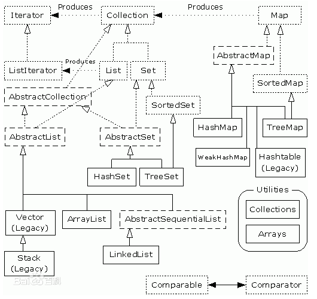

## Java集合

### 1. 集合



如上图所示, Map接口和Collection接口是所有集合框架的父接口：

1. Collection子接口分为List和Set
2. List接口的实现类有ArrayList, LinkedList, Vector, Stack
3. Set接口的实现类有HashSet和TreeSet
4. Map接口的实现类有 TreeMap,HashMap, HashTable

### 2. List接口

- ArrayList
  ArrayList相当于动态数组， 对get和set的调用花费常数时间，遍历时候一般随机访问即可，缺点是新项的插入和现有项的删除
  代价比较高。
- LinkedList
  LinkedList采用双链表实现，LinkedList同时实现了Deque接口，具有队列的特点，随机访问较慢，插入删除较快，遍历的时候，
  一般使用迭代器。
- Vector和Stack
​  Vector基本是线程安全的ArrayList, 方法差不多，本质上还是数组。而Stack是栈，特点是先进后出，主要方法时push和pop
- Stack是继承Vector的，也就是Java中的Stack本质上还是一个动态数组。

```java
ArrayList, LinkedList, Vector, Stack是List的实现类
ArrayList 是一个数组队列，相当于动态数组。它由数组实现，随机访问效率高，随机插入，随机删除效率低。
LinkedList 是一个双向链表。它可以被当做堆栈，队列或者双端队列进行操作。LinkedList随机访问效率低，但随机插入，随机删除效率高。
Vector 是矢量队列，和ArrayList一样，是动态数组，由数组实现，但是ArrayList是非线程安全的，而Vector是线程安全的。
Stack 是栈，继承自Vector, 它的特性是：先进后出（FILO, First In Last Out）
使用场景：
如果涉及到"栈"， "队列"，"链表" 等操作，应该考虑List, 具体使用哪个List, 根据下面的标准来选择：
1. 对于需要快速插入，删除的元素， 应该使用LinkedList
2. 对于需要快速随机访问的元素， 应该使用ArrayList
3. 对于“单线程环境” 或者 “多线程环境， 但是单线程使用List操作” ，此时应该使用非同步的类（如ArrayList）
4. 对于“对于多线程环境，且List可能同时会被多个线程操作”， 此时应该使用同步的类 （如 Vector）
```

### 3. Set和Map接口

HashSet和HashMap中的项必须提供equals方法和hashCode方法，HashSet和HashMap都主要通过之前的分离散列的代码实现的，而HashSet又是在HashMap的基础上是实现的。

- HashMap
- HashSet
- HashTable
  HashTable 继承Dictionary类，实现Map接口，主要特点是它是线程安全的，基本方法用synchronized锁住的，其他构造模式和HashMap基本一样。

总结：

1. HashMap是非线程安全的，HashTable是线程安全的。
2. HashMap的键和值都是允许null值存在的， 而HashTable是不允许
3. 因为线程安全问题，HashMap效率比HashTable的要高
4. HashMap的迭代器（Iterator）是fail-fast迭代器， 而Hashtable的enumeration迭代器不是fail-fast的。
   所以当有其他线程改变了HashMap的结构（增加或者移除元素），将会抛出 CocurrentModificationException

问题来了，HashTable的效率低下，而HashMp其实提供了访问器同步的map的静态的方法synchornizedMap(), 但是这个同步map仍然有这样那样的问题，于是ConcurrentHashMap出现了，这是更好的选择。

### 4. Comparable和Comparator

如果某个类实现Comparable接口，实现其中的CompareTo()方法，则这个类就具有比较的功能。Comparator则在某个类的外部实现， 具体来说是实现Comparator接口， 实现其中的compare()方法，最终变成一个比较器Comparator比较器需要作为参数和工具Collection-Utils或者其他数据结构配合使用。

### 5. Queue

Queue是一种很常见的数据结构类型，在Java里面Queue是一个接口，与List和Set一样是继承自Collection接口的。Deque是一个双向队列，继承自Queue, 不仅具有FIFO的Queue实现，也有FILO的实现。也就是不仅可以实现队列，也可以实现一个堆栈。 而LinkedList也实现了Dueque。

- 先进先出队列

```java 
// FIFO 先进先出队列 
private static void testQueue(){
    Queue<String>  stringQueue = new LinkedList<>();
    stringQueue.offer("A");
    stringQueue.offer("B");
    stringQueue.offer("C");

    // queue A->B->C A 是队列头部 C是队列尾部
    // * Retrieves, but does not remove, the head of this queue,
    // * or returns {@code null} if this queue is empty.
    System.out.println("Peek "+stringQueue.peek());
    // * Retrieves and removes the head of this queue,
    // * or returns {@code null} if this queue is empty.
    System.out.println("Poll  "+stringQueue.poll());
    System.out.println(stringQueue);
    System.out.println("Poll "+stringQueue.poll());
    System.out.println(stringQueue);
    System.out.println("Poll "+stringQueue.poll());
    System.out.println(stringQueue);
}
```

输出结果：

```java
Peek A
Poll  A
[B, C]
Poll B
[C]
Poll C
[]
```
结论：
Queue的offer()方法会将元素依次按照从队列头插入到队列尾部，peek()方法是获取队列头部的元素，poll()方法是移除队列头部的元素并返回。
- 单队列

```java 
// 单队列
private static void testQueue2(){
        Deque<String> stringQueue = new LinkedList<>();
        stringQueue.offer("A");
        stringQueue.offer("B");
        // A->B
        System.out.println(" "+stringQueue);
        // B
        stringQueue.poll();
        System.out.println(" "+stringQueue);
}
```
输出结果：
```java
 [A, B]
 [B]
```

```java
// 双头队列
private static void testQueue3(){
    Deque<String> stringQueue = new LinkedList<>();
    stringQueue.offerFirst("A");
    stringQueue.offer("B");
    stringQueue.offerLast("C");
    System.out.println(" "+stringQueue);
    stringQueue.pollFirst();
    System.out.println(" "+stringQueue);
    stringQueue.pollLast();
    System.out.println(" "+stringQueue);
}
```
输出结果：
```java
[A, B, C]
[B, C]
[B]
```
结论：offerFirst()是在队列头插入一个元素，offerLast()是在队列尾部插入一个元素。pollFirst()是移除队列头部的第一个元素，pollLast()是移除队列尾部的最后一个元素。

```java
// 堆栈 先进后出 FILO
private static void testQueue4(){
    Deque<String> stringQueue = new LinkedList<>();
    stringQueue.push("A");
    stringQueue.push("B");
    stringQueue.push("C");
    stringQueue.push("D");
    // D->C->B->A 栈底是A 栈顶是D 从栈顶到栈底依次是 D C B A
    System.out.println(" "+stringQueue);
    // * Pops an element from the stack represented by this deque.  In other
    // * words, removes and returns the first element of this deque.
    stringQueue.pop();
    System.out.println(" "+stringQueue);
    stringQueue.pop();
    System.out.println(" "+stringQueue);
    stringQueue.pop();
    System.out.println(" "+stringQueue);
    stringQueue.pop();
    System.out.println(" "+stringQueue);
}
```
输出结果：
```java
[D, C, B, A]
[C, B, A]
[B, A]
[A]
[] 
```
结论：pop()方法移除栈顶的元素并返回该元素。
#### 6. HashMap的原理
HashMap是一个数组链表结构，数组指的的是数组坑位  Node<K,V>[] table，链表指的是把hash方法处理的key通过 hash&[tab.length-1] 处理计算出来的坑位，具有相同坑位号数据存放在同一个链表中。put(K, V) 方法添加一个元素， 都会根据Key进行hash处理和坑位处理（hash&[tab.length-1]），然后在散列数组中找到对应的数组(坑位)下标，然后再对链表处理，追加在链表的后面。get(K) 也是同理，根据Key计算出坑位之后，然后找到相应链表的第一个节点，然后按照顺序向后比较每个Node的hash值和Key值，如果Key值，hash值和Node的Key值，hash值相同即我们要找的Node,  最后Node.Value获取对应的Value。

散列数组坑位计算
```java
public static void main(String[] args) {
    int b = 31;
    int a = 1222222;
    int result = a & b;
    int d = 123456;
    int result2 = d & b;
    System.out.println("a&b result is  " + result);
    System.out.println("d&b result is  " + result2);
    Random random = new Random(System.currentTimeMillis());
    for (int index = 0; index < 1000; index++) {
        int xx = random.nextInt(1000);
        System.out.println(xx+"  "+(xx & b));
    }
}
```
输出结果：
```java
a&b result is  14
d&b result is  0
161 1
406 22
423 7
736 0
537 25
...
```
从上面的结果来看，a和b进行& 运算，得到的结果c=(a&b) 一定小于a和b中的最小值，及（n-1)&hash 的值i一定在长度n之内，不会越界，且坑位受hash的
坑位散列能力影响，经过计算，我们看到 这个长度n最好是2的次幂，这样才能具有好的横向散列效果，让key能够比较轻松散列到tab数组坑中。

LinkedHashMap是双向链表，HashMap是单向链表, LinkedHashMap 有前驱Entry<K, V> 和 后驱Entry<K,V> , 而HashMap只有后驱Node
