- [APK 包优化](#apk-包优化)
  - [APK包优化问题点](#apk包优化问题点)
  - [1. 删除无用的代码](#1-删除无用的代码)
  - [2. 删除无用资源文件](#2-删除无用资源文件)
  - [3. 通过InspectCode方式检查代码](#3-通过inspectcode方式检查代码)
  - [3. 保留需要的so文件](#3-保留需要的so文件)
    - [1. Density分割](#1-density分割)
    - [2. ABI分割](#2-abi分割)
  - [4. 图片压缩](#4-图片压缩)
  - [5. SVG，WebP](#5-svgwebp)
  - [6. 资源打包配置](#6-资源打包配置)
  - [6. 代码压缩和混淆](#6-代码压缩和混淆)
  - [7. 微信混淆资源名称](#7-微信混淆资源名称)
    - [1. 配置混淆资源文件名插件](#1-配置混淆资源文件名插件)
    - [2. 在build.gradle中使用插件](#2-在buildgradle中使用插件)
    - [3. 添加混淆文件名称配置](#3-添加混淆文件名称配置)
    - [4. 生成apk](#4-生成apk)
## APK 包优化
### APK包优化问题点
APK安装包的大小如果说在有Wifi的情况下，大些感觉问题不大，但是在流量情况下进行安装是让人比较不顺心的。因此，包的大小对用户体验很重要，一般情况下，我们对包的体积要求是尽可能的小，那么就有一些不必要的东西需要被删除，或者说是只安装一部分功能需求，后期有需要的功能，通过插件化的方式下发到客户端，然后进行安装，或者在项目初期的时候，就采用混合开发的方式对后期需要的需求通过下发JS和网页等资源文件（图片资源一般是网络加载，然后缓存到本地，再通过WebView的资源拦截进行替换）的情况来处理。从总体上来看基本上就是以上三种思路，但是对于一般普通的开发，需要细化有哪些优化点呢？无用代码，资源删除，只保留需要的资源文件，so只保留armeabi-v7a(或者armeabi)，利用图片压缩进行图片压缩，或者SVG，WebP格式的图片，代码混淆。
### 1. 删除无用的代码
这个正常操作，删除无用的代码，通常是通过手动删除，但是AndroidStudio提供了可以检测无用代码的工具，在Analyze->Run inspection by Name->Unused Declaration查出没有被使用的代码。
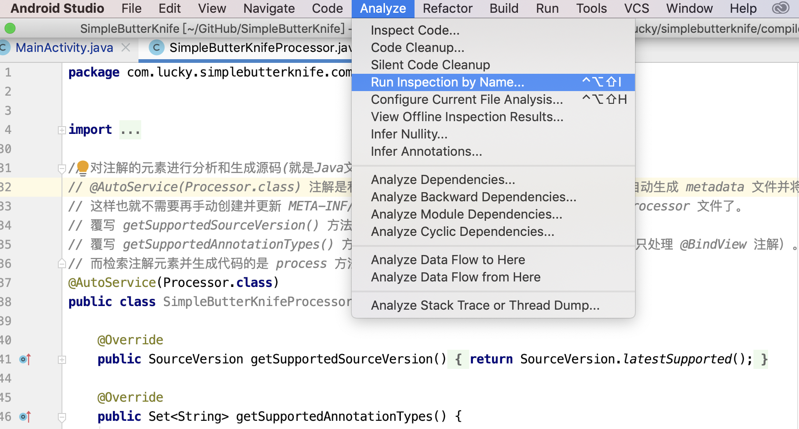
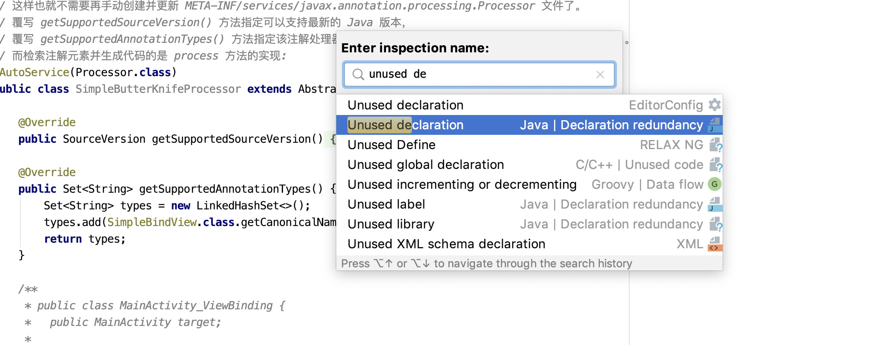
下面展示的就是没有被使用的代码
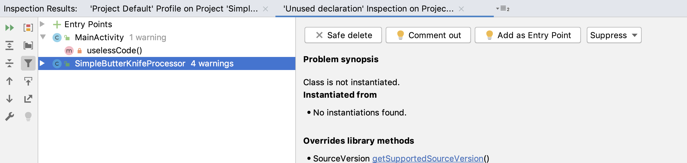
### 2. 删除无用资源文件
通过AndroidStudio同样也可以确定没有被使用的资源文件，在Refactor->Remove Unused Resources
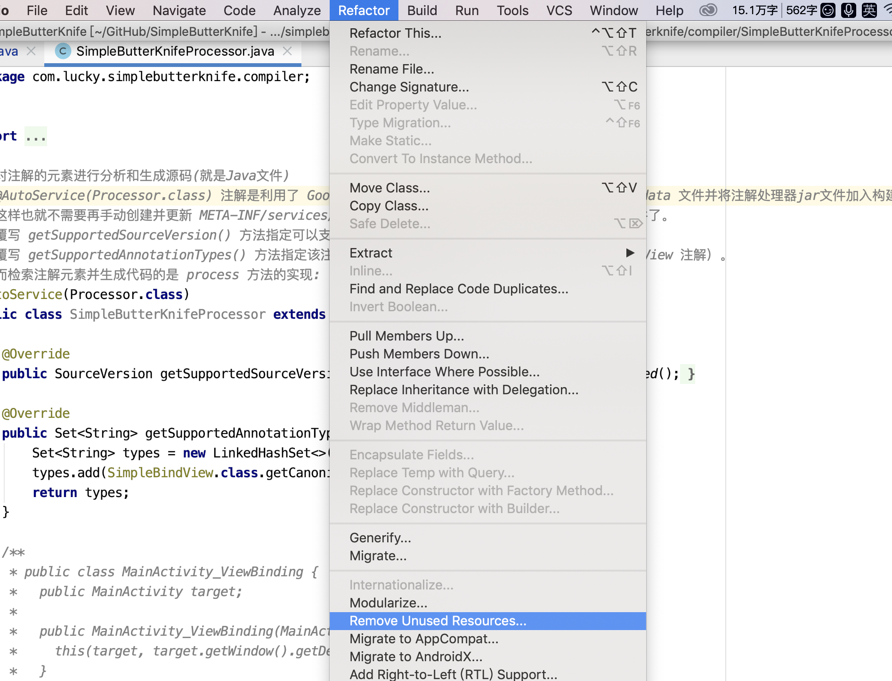
下面展示的就是没有被使用的资源文件
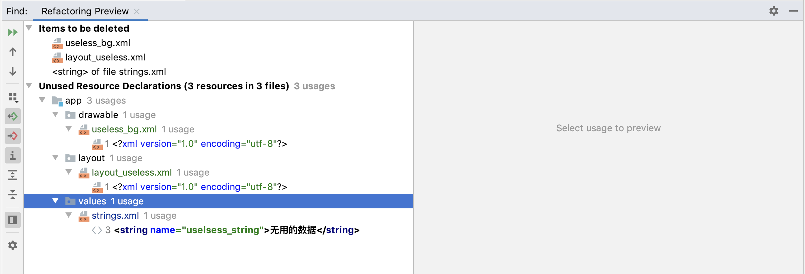
### 3. 通过InspectCode方式检查代码
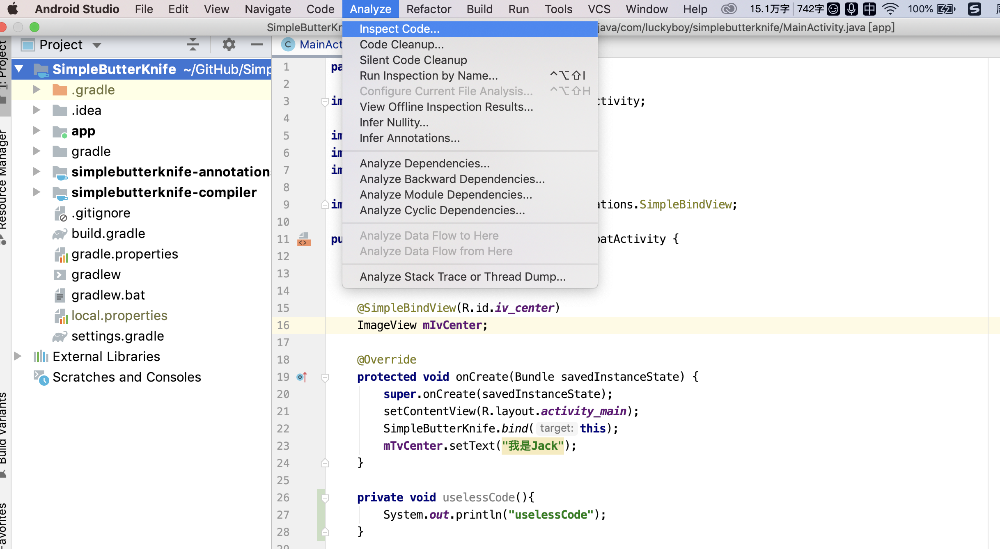
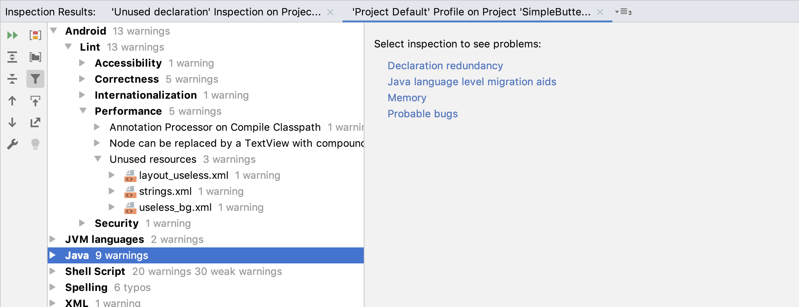
### 3. 保留需要的so文件
正常情况下，我们一般只保留armeabi-v7a或者armeabi中的一个就可以了，因为市场上基本上都只有这两种，且armeabi-v7a是兼容armeabi的。所以我们只需要加载需要的so文件即可。
```java
ndk {
    // 只加载armeabi和aremeabi-v7a这两种类型的so文件
    abiFilters "armeabi", "armeabi-v7a"
}
```
也可以利用Splits分割来生成含有不同资源的apk，我们可以通过在android配置代码中定义一个splits代码块来配置分割，目前支持density分割和ABI分割。splits中支持以下属性：
> 1. enable：boolean型，表示打开或关闭APK分割功能
> 2. reset()：复位，若要使用include功能，则使用前需调用reset()
> 3. include：创建白名单，仅构建出白名单中指定的格式
> 4. exclude：黑名单，不会构建出黑名单中指定的格式
> 5. compatibleScreens(仅限density)：在清单文件中添加<screen>...</screen>
> 5. universalApk(仅限ABI)：默认为true，即除了指定的格式外，还会构建出一个通用的APK
#### 1. Density分割
写法如下：
```java
//在build.gradle文件的android节点下添加
android {
  splits {
      density{
        enable true
        exclude 'ldpi','mdpi'
        compatibleScreens 'normal','large','xlarge'
      }
  }
}

```
```console
//最后输出产生的apk文件
//universal.apk文件中包含了各种分辨率的图片 xhdpi.apk只包含xhdpi分辨率的图片
zfz:debug zhangfengzhou$ tree .
.
├── app-universal-debug.apk
├── app-xhdpi-debug.apk
├── app-xxhdpi-debug.apk
├── app-xxxhdpi-debug.apk
└── output.json
```
#### 2. ABI分割
写法如下
```java
android {
  sourceSets {
     main {
        jni.srcDirs = []
        jniLibs.srcDirs = ['libs']
     }
  }

  splits {
     abi {
       enable true
       reset()
       include 'x86', 'armeabi-v7a','armeabi'
       universalApk true
     }
  }
}
```
```console
//最后输出产生的apk文件
//universal.apk包含x86,armeabi-v7a,armeabi三种so的包，armeabi.apk是只包含armeabi的so的包。
.
├── app-armeabi-debug.apk
├── app-armeabi-v7a-debug.apk
├── app-universal-debug.apk
├── app-x86-debug.apk
└── output.json
```
### 4. 图片压缩
可以通过[TinyPng](https://tinypng.com)网站对图片进行线上压缩处理，也可以利用插件对项目中的图片进行线下压缩处理。
[img-optimizer-gradle-plugin](https://github.com/chenenyu/img-optimizer-gradle-plugin)插件使用方法如下：
1. 首先在项目根build.gradle文件中添加插件
```java
dependencies {
    classpath 'com.android.tools.build:gradle:4.0.0'
    classpath 'com.chenenyu:img-optimizer:1.2.0'
}
```
2. 在App模块中使用插件
```java
apply plugin: 'img-optimizer'
```
3. 配置相关选项
```java
optimizerOptions {
    triggerSize 5 
    type "lossy" 
    suffix "_opt"
}
```
triggerSize 5 // 对大小在5k以上的图片进行压缩优化处理, 默认是0 即对所有的图片进行压缩处理

type "lossy" //type 分为两种类型 lossy lossless, "lossy"为极限压缩(推荐，速度快，压缩率高)，"lossless"为无损压缩(速度慢，压缩率低，与原图无差别)

suffix "_opt" // 优化后的图片后缀。假如配置为"_opt"，ic_launcher.png经过优化后，将会生成ic_launcher_opt.png。默认为空，即覆盖原图。

4. Gradle任务
在进行如上的配置并同步之后，我们在Gradle控制面板中可以看到新增加了两个任务 optimizeDebug, optimizeRelease
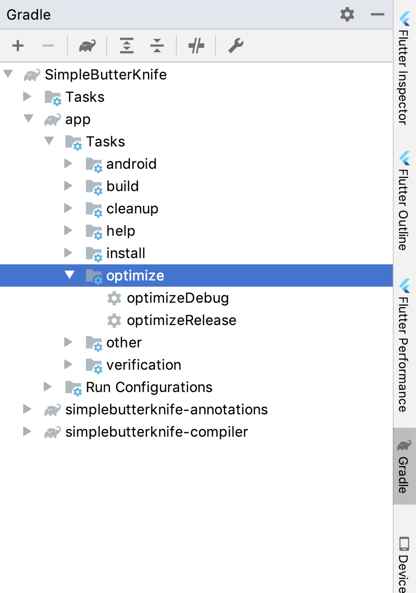
5. 生成优化图片
点击optimizeDebug或者optimizeRelaese, 就可以在对应的不同图片分辨率目录中生成优化后的图片，效果还是比较好的，但是注意一个前提，优化的图片必须是png格式的，否则会有问题，jpg格式不会处理的。
### 5. SVG，WebP
SVG图片可以由设计人员出图，也可以在AndroidStduio中查找已有的SVG图片
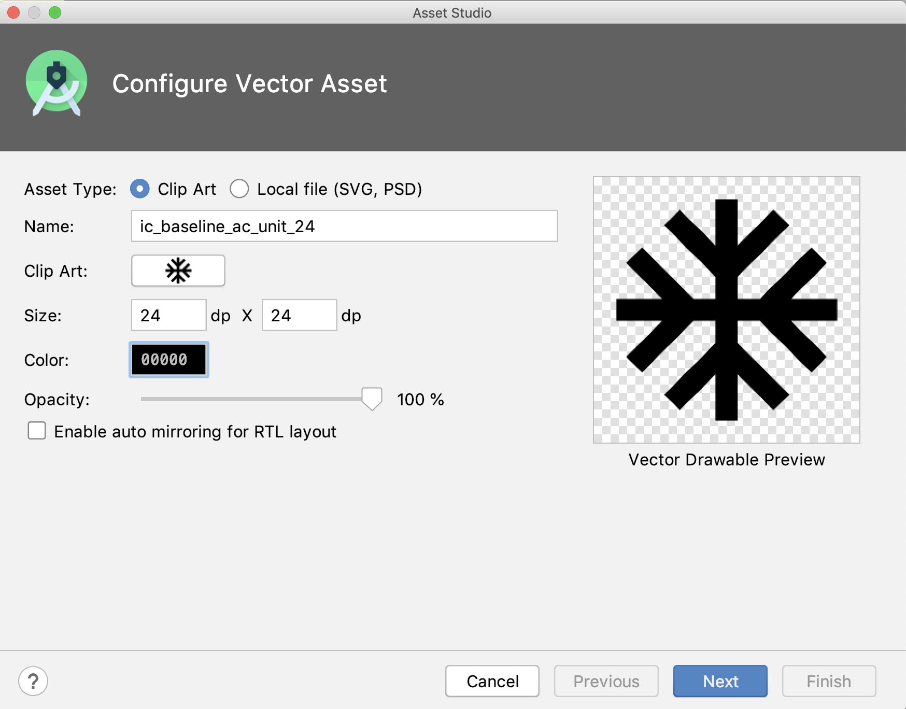
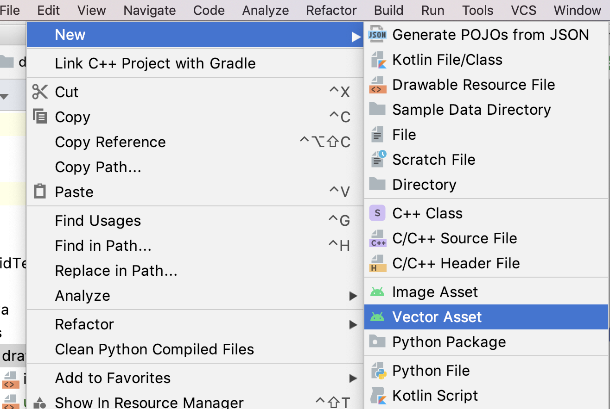
WebP也是能够很明显的降低图片的大小的图片格式


### 6. 资源打包配置
```console
defaultConfig {
    ....
    // 只保留en, zh-rTw这两种语言的字符串资源文件
    resConfigs "en","zh-rTw"
}
```
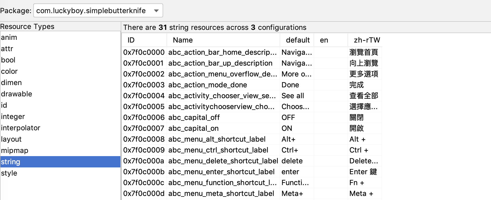

### 6. 代码压缩和混淆
```java
release {
    shrinkResources true // 删除无用资源
    minifyEnabled true   // 开启代码混淆
    zipAlignEnabled true // 字节对齐
    proguardFiles getDefaultProguardFile('proguard-android-optimize.txt'), 'proguard-rules.pro'
}
```
```console
// proguard-rules.pro 自定义混淆规则文件
```
[App混淆规则](../App混淆规则/App混淆规则.md)
### 7. 微信混淆资源名称
[微信混淆资源文件名称-张绍文](https://github.com/shwenzhang/AndResGuard/blob/master/README.zh-cn.md)

#### 1. 配置混淆资源文件名插件
```java
// 配置混淆插件
dependencies {
    classpath 'com.android.tools.build:gradle:4.0.0'
    classpath 'com.chenenyu:img-optimizer:1.2.0'
    classpath 'com.tencent.mm:AndResGuard-gradle-plugin:1.2.18'
}
```
#### 2. 在build.gradle中使用插件
```java
apply plugin: 'AndResGuard'
```
#### 3. 添加混淆文件名称配置
```java
android {
   ...
}
andResGuard {
    // mappingFile = file("./resource_mapping.txt")
    mappingFile = null
    use7zip = true
    useSign = true
    // 打开这个开关，会keep住所有资源的原始路径，只混淆资源的名字
    keepRoot = false
    // 设置这个值，会把arsc name列混淆成相同的名字，减少string常量池的大小
    fixedResName = "arg"
    // 打开这个开关会合并所有哈希值相同的资源，但请不要过度依赖这个功能去除去冗余资源
    mergeDuplicatedRes = true
    whiteList = [
            // for your icon
            "R.mipmap.ic_launcher",
            // for fabric
            "R.string.com.crashlytics.*",
            // for google-services
            "R.string.google_app_id",
            "R.string.gcm_defaultSenderId",
            "R.string.default_web_client_id",
            "R.string.ga_trackingId",
            "R.string.firebase_database_url",
            "R.string.google_api_key",
            "R.string.google_crash_reporting_api_key"
    ]
    compressFilePattern = [
            "*.png",
            "*.jpg",
            "*.jpeg",
            "*.gif",
    ]
    sevenzip {
        artifact = 'com.tencent.mm:SevenZip:1.2.18'
        //path = "/usr/local/bin/7za"
    }

    /**
     * 可选： 如果不设置则会默认覆盖assemble输出的apk
     **/
    // finalApkBackupPath = "${project.rootDir}/final.apk"

    /**
     * 可选: 指定v1签名时生成jar文件的摘要算法
     * 默认值为“SHA-1”
     **/
    // digestalg = "SHA-256"
}

dependencies{
  ...
}
```
#### 4. 生成apk 
在Gradle一栏中找到andresguard，会看到三个个Task, resguardDebug, resguardRelease, resguarduseapk, 前两个是生成新的经过资源名混淆后的apk, 后一个暂时不清楚是干什么用的。


