- [Java虚拟机](#java虚拟机)
  - [一 程序计数器 （关键字：字节码地址）](#一-程序计数器-关键字字节码地址)
  - [二 Java虚拟机栈（线程栈）](#二-java虚拟机栈线程栈)
    - [局部变量区域](#局部变量区域)
    - [操作数栈](#操作数栈)
    - [动态链接](#动态链接)
    - [方法返回地址](#方法返回地址)
    - [额外附加信息](#额外附加信息)
  - [三 本地方法栈](#三-本地方法栈)
  - [四 堆（Heap）](#四-堆heap)
  - [五 方法区](#五-方法区)
    - [类的基本信息](#类的基本信息)
    - [已装载类的详细信息](#已装载类的详细信息)
  - [六 直接内存](#六-直接内存)
  - [七 执行引擎](#七-执行引擎)
  - [八 Java的双亲委托机制](#八-java的双亲委托机制)
  - [九 类加载和初始化过程](#九-类加载和初始化过程)
  - [十 Java虚拟机参数](#十-java虚拟机参数)
## Java虚拟机
Java虚拟机是了解ava对象在从加载到运行和结束的完整生命周期流程和环节的重要部分，因此学习好Java虚拟机是深入了解Java机制的途径。


从上图可以看到Java虚拟机包含五大部分：程序计数器， 虚拟机栈， 本地方法栈， 方法区(内含常量池)， 堆(Heap)。其中方法区和堆为所有的线程所共享，程序计数器，虚拟机栈，本地方法栈为线程独享。

### 一 程序计数器 （关键字：字节码地址）
程序计数器类似于CPU寄存器中PC寄存器，用于存放指令地址。因为Java虚拟机是多线程的，所以每个线程都有一个独立
的线程计数器，它与线程共存亡。不过Java虚拟机中的程序计数器指向的是正在执行的字节码地址，而CPU的PC寄存器指向的
是下一条指令的地址。当线程去执行Native方法时，程序计数器则为Undefined。程序计数器存在的主要考虑是因为线程切换，
当CPU切换到其他线程的时候，需要保存当前线程运行的地址，当CPU又切换回来的时候，需要从程序计数器中返回之前保存的地址，
继续运行。

### 二 Java虚拟机栈（线程栈）
一个线程一个Java虚拟机栈，并且生命周期和线程相同。它的内部由一个个栈帧构成，一个栈帧代表一个调用的方法，线程在每次方法调用执行时
创建一个栈帧然后压栈，栈帧用于存放局部变量表，操作数，动态链接，方法出口等信息。方法执行完成后对应的栈帧出栈。我们平时说的
栈内存就是指的这个栈。

一个线程中的方法可能还会调用其他的方法，这样就构成方法调用链，而且这个链可能会很长，而且每个线程都有方法处于执行状态。
对于执行引擎来说，只有活动线程栈顶的栈帧才是有效的，称为当前栈帧（Current Stack Frame）, 这个栈帧关联的方法称为当前方法（Current Method）。

每一个栈帧的结构都包含了局部变量，操作数栈，方法返回地址，动态链接， 额外附加信息。
某个方法的栈帧需要多大的局部变量表，多深的操作数栈都在编译程序时完全确定了，并且写入到类方法表的
相应属性中，因此某个方法的栈帧需要分配多少内存，不会受到程序运行期变量数据变化的影响，而仅仅取决于
具体的虚拟机的实现。
#### 局部变量区域
存储方法的局部变量和参数，存储单位以slot(4 byte)为最小单位。局部变量存放的数据类型有：基本数据类型，
对象引用和return address (指向一条字节码指定的地址)。 其中64位长度的long 和double 类型的变量会占用2个slot,
其他数据类型只占用1个slot。

关于局部变量，还有一点需要注意：就是局部变量不像类的实例变量那样会有默认的初始化值。
所以局部变量需要手工初始化，如果一个局部变量定义了但没有赋值初始化是不能使用的。

#### 操作数栈
操作数栈是指那些被指令操作的数据。当需要对参数操作时， 如 `c= a+b`， 就将即将被操作的参数数据
压栈，如将a和b压栈，然后由操作指令将它们弹出，并执行操作。虚拟机将操作数栈称为工作区。
Java虚拟机没有寄存器，所有参数传递，值返回都是使用操作栈来完成的。

Java 虚拟机的解释执行引擎称为 ”基于栈的执行引擎“， 其中所指的”栈“ 就是操作数栈。

例如下面这段代码：
```java
public class Math {

    public static int initData = 666;
    public static User user = new User();


    public int compute(){
        int a = 1;
        int b = 2;
        int c = (a+b)*10;
        return c;
    }

    public static void main(String[] args) {
        Math math = new Math();
        math.compute();
        System.out.println("Hello");
    }

    static class User {

    }
}
```
我们用命令 `javac Math.java` 将Math.java文件进行编译，然后执行`java Math` 可以看到正常输出 `Hello`。 说明我们编写的文件没有问题，然后我们用Sublime软件打开可以看到编译出的`Math.class`文件，内容如下：
```console
cafe babe 0000 0034 0030 0a00 0c00 1e07
001f 0a00 0200 1e0a 0002 0020 0900 2100
2208 0023 0a00 2400 2509 0002 0026 0700
270a 0009 001e 0900 0200 2807 0029 0100
0455 7365 7201 000c 496e 6e65 7243 6c61
7373 6573 0100 0869 6e69 7444 6174 6101
0001 4901 0004 7573 6572 0100 0b4c 4d61
7468 2455 7365 723b 0100 063c 696e 6974
3e01 0003 2829 5601 0004 436f 6465 0100
0f4c 696e 654e 756d 6265 7254 6162 6c65
....
001d 000e 0000 000a 0001 0009 0002 000d
0008 
```

这种显示的内容我们可能看不懂，我们可以借助命令来查看`javap`
```console
zfz:~ zhangfengzhou$ javap
用法: javap <options> <classes>
其中, 可能的选项包括:
  -help  --help  -?        输出此用法消息
  -version                 版本信息
  -v  -verbose             输出附加信息
  -l                       输出行号和本地变量表
  -public                  仅显示公共类和成员
  -protected               显示受保护的/公共类和成员
  -package                 显示程序包/受保护的/公共类
                           和成员 (默认)
  -p  -private             显示所有类和成员
  -c                       对代码进行反汇编
  -s                       输出内部类型签名
  -sysinfo                 显示正在处理的类的
                           系统信息 (路径, 大小, 日期, MD5 散列)
  -constants               显示最终常量
  -classpath <path>        指定查找用户类文件的位置
  -cp <path>               指定查找用户类文件的位置
  -bootclasspath <path>    覆盖引导类文件的位置
```
利用命令`javap -c`将代码进行反汇编
```console
zfz:src zhangfengzhou$ javap -c Math.class >Math.txt
```
我们将反编译出来的内容输出到Math.txt文本文件中，我们可以很轻松的看到我们定义的类，静态变量，方法等，其中内容如下：
```console
Compiled from "Math.java"
public class Math {
  public static int initData;

  public static Math$User user;

  public Math();
    Code:
       0: aload_0
       1: invokespecial #1                  // Method java/lang/Object."<init>":()V
       4: return

  public int compute();
    Code:
       0: iconst_1
       1: istore_1
       2: iconst_2
       3: istore_2
       4: iload_1
       5: iload_2
       6: iadd
       7: bipush        10
       9: imul
      10: istore_3
      11: iload_3
      12: ireturn

  public static void main(java.lang.String[]);
    Code:
       0: new           #2                  // class Math
       3: dup
       4: invokespecial #3                  // Method "<init>":()V
       7: astore_1
       8: aload_1
       9: invokevirtual #4                  // Method compute:()I
      12: pop
      13: getstatic     #5                  // Field java/lang/System.out:Ljava/io/PrintStream;
      16: ldc           #6                  // String Hello
      18: invokevirtual #7                  // Method java/io/PrintStream.println:(Ljava/lang/String;)V
      21: return

  static {};
    Code:
       0: sipush        666
       3: putstatic     #8                  // Field initData:I
       6: new           #9                  // class Math$User
       9: dup
      10: invokespecial #10                 // Method Math$User."<init>":()V
      13: putstatic     #11                 // Field user:LMath$User;
      16: return
}
```
我们取出`compute()`方法对应的反编译的结果：
```console
public int compute();
    Code:
       0: iconst_1
       1: istore_1
       2: iconst_2
       3: istore_2
       4: iload_1
       5: iload_2
       6: iadd
       7: bipush        10
       9: imul
      10: istore_3
      11: iload_3
      12: ireturn
```
注意：iconst，istore, iload等都是JVM指令的助记符，可以用常人理解的方式表示指令操作。
数据先进的是操作数栈 然后进入的是局部变量表

- 0: iconst_1 表示将int型常量值1压入操作数栈
- 1: istore_1 表示将栈顶int型数值存入第一个局部变量
- 2: iconst_2 表示将int型常量值2压入操作数栈
- 3: istore_2 表示将栈顶int型数值存入第二个局部变量
- 4: iload_1  表示将第一个int型局部变量进栈
- 5: iload_2  表示将第二个int型局部变量进栈
- 6: iadd     表示将栈顶两个int型数值相加，并且结果进栈 
- 7: bipush 10表示将一个8位带符号的整数进栈
- 9: imul 表示整数型乘法 这里的意思就是3和10弹出栈，得到30后入栈
- 10: istore_3 表示将栈顶int型数值存入第三个局部变量
- 11: iload_3 表示将第三个int型局部变量进栈
- 12: ireturn 表示将操作数栈中的整数返回 即将30返回

通过上面的学习，我们可以知道等号=后面的就是操作数，在这些操作数进行赋值，运算的时候需要内存存放，
那就是存放在操作数栈中，作为临时存储操作数的一小块内存区域。

#### 动态链接
它是指向运行时常量池中该栈帧所属方法的引用。这个引用是为了支持方法调用过程中能进行动态
链接。我们知道Class文件的常量池存有该方法的符号引用，字节码中的方法调用指令就以指向常量池中的
方法的符号引用为参数。这些符号引用一部分会在类加载阶段或者第一次使用的时候转化成直接引用，这种转化
称为静态解析。余下部分将在每一次运行期间转化为直接引用，这部分称为动态链接。

#### 方法返回地址
正常退出，执行引擎遇到方法返回的字节码，将返回值传递给调用者

异常退出，遇到Exception， 并且方法并未捕获异常，返回地址由异常处理器来确定，
并且不会有任何返回值。

方法退出的过程实际上等同于把当前栈帧出栈， 因此退出时可能执行的操作有：恢复上层方法的
局部变量表和操作数栈，把返回值（如果有）压入调用者栈帧的操作数栈中，调整PC计数器的值
以指向方法调用指令后面的一条指令等。

#### 额外附加信息
虚拟机规范没有明确规定，由具体虚拟机实现。

Java虚拟机规范规定该区域有两种异常：

StackOverFlowError: 当线程请求栈深度超出虚拟栈所允许的深度时抛出
OutOfMemoryError:  当Java虚拟机动态扩展到无法申请足够内存时抛出

另外需要提醒一下， 在规范模型中，栈帧相互之间是完全独立的。但在大多数虚拟机的
实现里都会做一些优化处理，这样两个栈帧可能会出现一部分重叠。 这样在下面的栈帧会有
部分操作数栈与上面栈帧的部分局部变量表重叠在一起，这样在进行方法调用时就可以有
部分数据共享，而无需进行额外的参数赋值传递了。

### 三 本地方法栈
Java 可以通过Java本地方法JNI(Java Native Interface) 来调用其他语言编写（如C）的程序， 
在Java里面用native修饰符来描述一个方法是本地方法。本地方法栈就是虚拟机线程调用Native方法
执行时的栈，它与虚拟栈发挥类似的作用。但是要注意， 虚拟机规范中没有对本地方法栈作强制规定，
虚拟机可以自由实现，所有可以不是字节码。 如果字节码实现的话， 虚拟机栈本地方法可以合二为一，事实上，
OpenJDK和SunJDK自带的HotSpot虚拟机就是直接将虚拟机栈和本地方法栈合二为一的。

Java虚拟机规定该区域可抛出StackOverFlowError和OutOMemoryError.

### 四 堆（Heap）
这个区域用来放置所有对象实例和数组。不过在JIT（Just-in-time）情况下有些时候也可能在栈分配对象实例。
堆也是Java垃圾回收器管理的主要区域（所以很多时候称之为 GC堆）

从GC回收的角度来看，由于现在GC基本上都是采用的分代收集算法，所以堆内存结构还可以分块成：
新生代和老年代；再细一点的有Eden空间，From Survivor空间，To Survivor空间等。如下图：

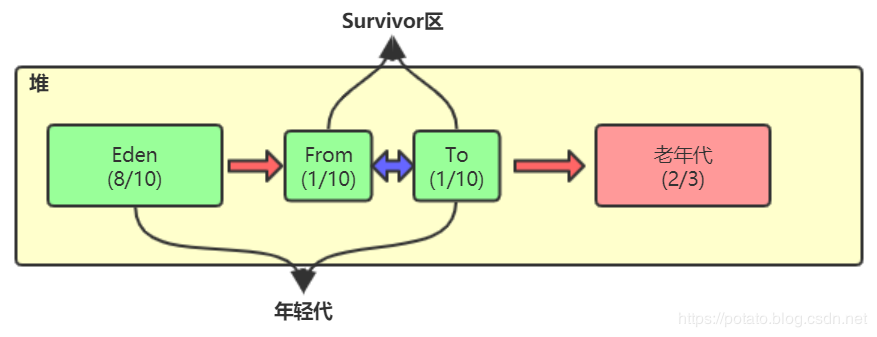

new出来的对象一般都放在Eden区域，当Eden区域满了之后呢？
假设我们给堆分配600M内存，这个是可以通过参数调节的的。那么老年代默认是占2/3的，也就是差不多400M，那么年轻代就是200M，Eden区160M（8/10），Survivor区40M(2/10)。

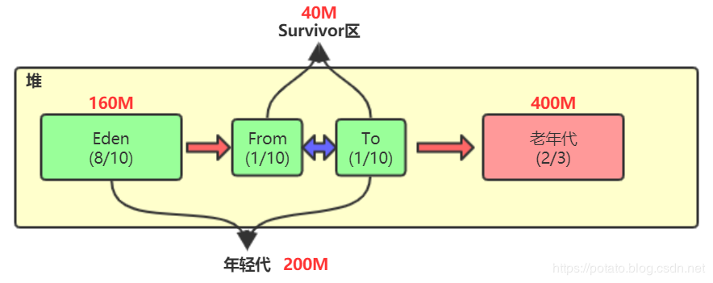

GC 
一个程序只要一直运行，总会产生new新的对象，那么总有一刻Eden区就会放满，那么一旦Eden区域被放满之后，之后会干什么，没错，就是GC，
准确的来说是Minor GC, 虚拟机垃圾回收器就会收集并清理垃圾对象。

那么什么是垃圾对象？
好比我们上面说的对象，我们假设我们是一个Web应用程序，在main线程结束之后程序并不会结束，但是main方法结束了，那么main方法里面的栈帧就会被释放，里面的局部变量也会被释放，但是局部变量对应的堆内存中的对象并没有被释放，依然会占用内存空间，由于没有引用指向这些对象，那么这些对象就是属于垃圾对象。

这里会涉及GC ROOT和 可达性分析
可达性分析算法是将GC Roots对象作为起点，从这些起点开始向下搜索引用的对象，找到的对象都标记为非垃圾对象，其余未标记的对象为垃圾对象。

GC Roots根对象又是什么？GC Roots根就是判断一个对象是否可以回收的依据，只要能通过GC Roots根向下一直搜索能够搜索到的对象就不算垃圾对象，不能搜索到的对象就是垃圾对象。可以作为GC Roots根的有线程栈的本地变量，静态变量，本地方法栈的变量等等。

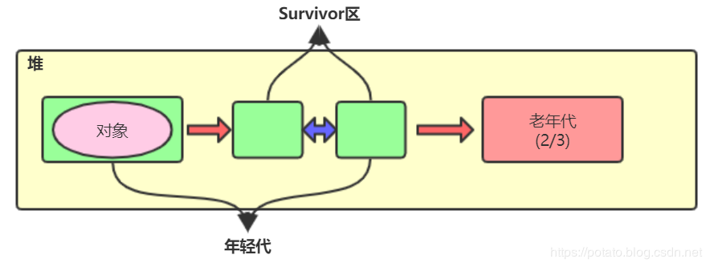

经历了第一次minor gc后，没有被清理的对象就会被移到From区，如上图。

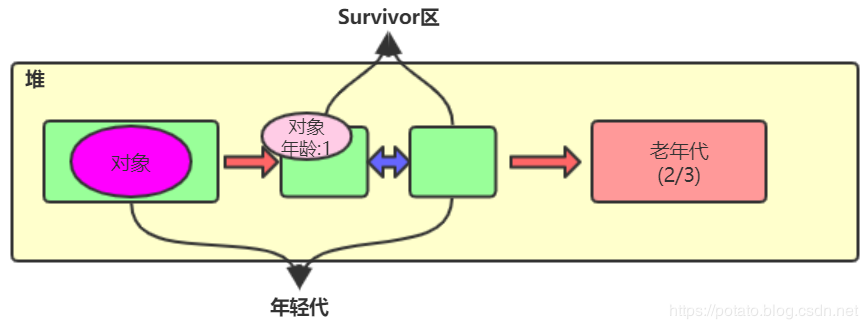

上面在说对象组成的时候有写到，在对象头的Mark Word中有存储GC分代年龄，一个对象每经历一次gc，那么它的gc分代年龄就会+1，如上图。


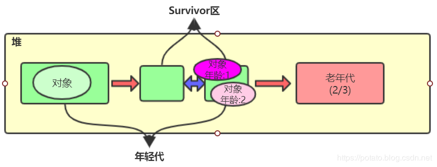

那么如果第二次新的对象又把Eden区放满了，那么又会执行minor gc，但是这次会连着From区一起gc，然后将Eden区和From区存活的对象都移到To区域，对象头中分代年龄都+1，如上图。


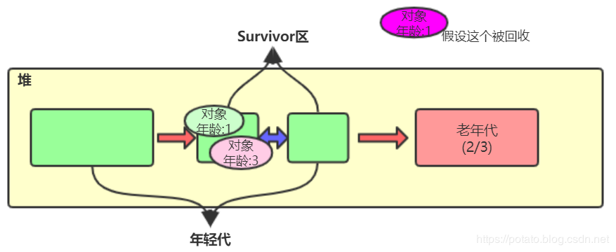

那么当第三次Eden区又满的时候，minor gc就是回收Eden区和To区域了，TEden区和To区域还活着的对象就会都移到From区，如上图。说白了就是Survivor区中总有一块区域是空着的，存活的对象存放是在From区和To区轮流存放，也就是互相复制拷贝，这也就是垃圾回收算法中的复制-回收算法。

如果一个对象经历了一个限值15次gc的时候，就会移至老年代。那如果还没有到限值，From区或者To区域也放不下了，就会直接挪到老年代，这只是举例了两种常规规则，还有其他规则也是会把对象存放至老年代的。

那么随着应用程序的不断运行，老年代最终也是会满的，那么此时也会gc，此时的gc就是Full gc了。

GC案例
```java
import java.util.ArrayList;
public class HeapTest {

    byte[] a = new byte[1024*100];

    public static void main(String[] args) throws InterruptedException{
        ArrayList<HeapTest> heapTests = new ArrayList<>();
        while (true){
            heapTests.add(new HeapTest());
            Thread.sleep(10);
        }
    }
}
```
运行以上代码，我们在命令行中输入命令`jvisualvm`可以看到启动一个Java VisualVM程序, 这个程序可以以可视化的方式来观察
Java对象的内存分配和线程运行情况。
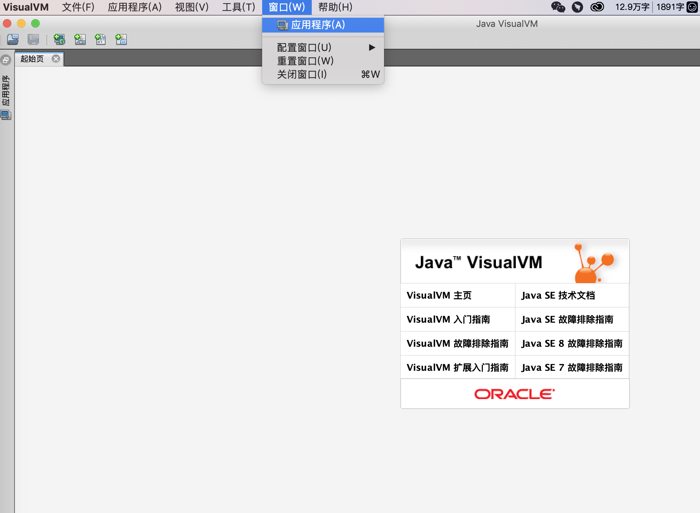
我们点击应用程序，可以看到并选择我们想要监控的`HeapTest`进程
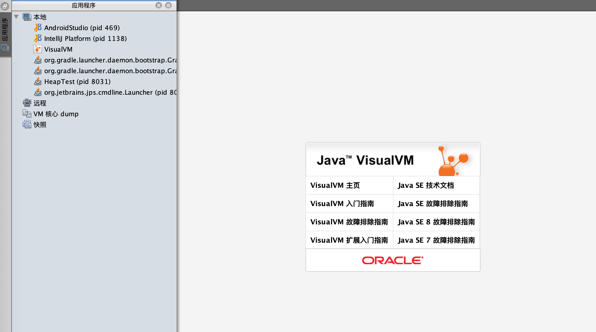
点击该进程之后可以看到如下
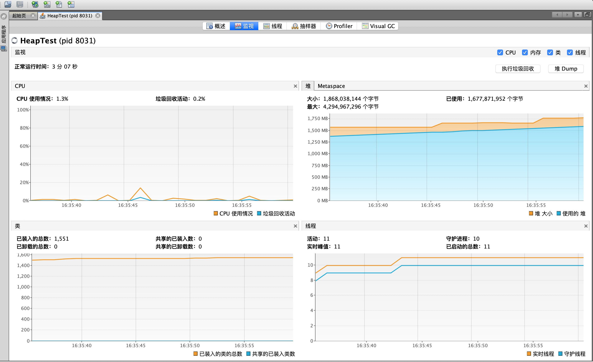
我们在右上角看到了一个VisualGC插件，这个需要我们自己安装，具体是在工具->插件->可用插件，下载安装完毕后重新
执行`jvisualvm`命令启动VisualVM程序，然后就可以看到新安装的插件了。点击该插件，我们可以发现如下：
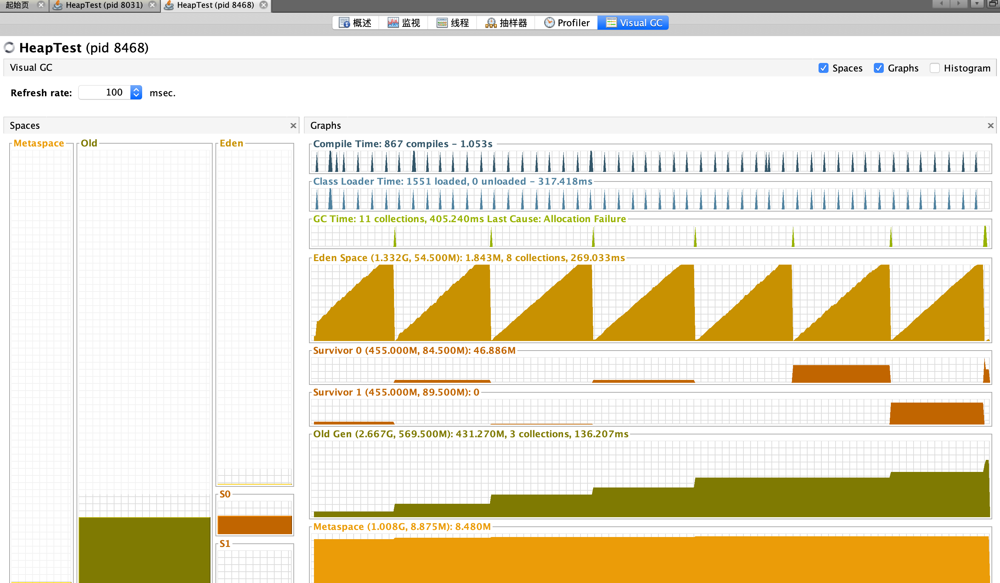

一小段时间内的运行内存分析

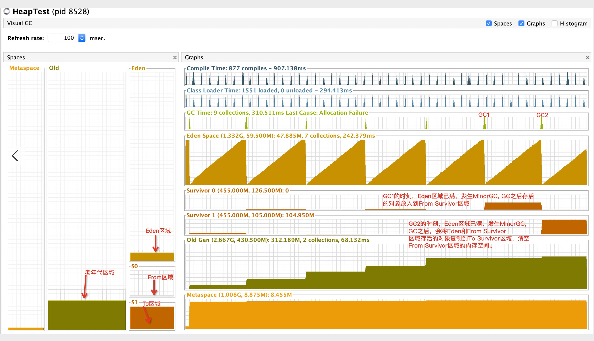
- 1：对象放入Eden区
- 2：Eden区满发生minor gc
- 3：第二步的存活对象移至From(Survivor 0)区
- 4：Eden区再满发生minor gc
- 5：第四步存活的对象移至To(Survivor 1)区

从上面的图片，我们看到From区域和To区域在同一个时间段内，总有一方是的空的，这个我们前面分析的一致，这两个区域垃圾回收算法用的是标记复制算法。老年代这块，可以看出每次发生MinorGC的时刻，会有一些对象被移入到老年代区域。

因为我们不断的new出HeapTest添加到列表，HeapTest对象会被列表引用，然而列表是局部变量，程序是死循环，Full GC发生的时候列表不会被回收，列表不会回收，那么列表集合中的元素自然也不会被回收。但是如果老年区内存满了怎么办，会发生内存溢出。
```java
Exception in thread "main" java.lang.OutOfMemoryError: Java heap space
at HeapTest.<init>(HeapTest.java:5)
at HeapTest.main(HeapTest.java:10)
```

### 五 方法区
它是虚拟机在加载类文件时，用于存放加载过的类信息，常量，静态变量，以及JIT编译后的代码（类方法）等数据的内存区域，
它是线程共享的。在JDK1.8之前，有一个名叫持久代/永久代，在JDK1.8之后，Oracle官方改名为元空间，存放常量，静态变量，类元信息。

方法区存放的信息包括：

#### 类的基本信息
- 每个类的全限定名
- 每个类的直接超类的全限定名（可约束类型转换）
- 该类是类还是接口
- 该类型的访问修改符
- 直接超接口的全限定名的有序列表

#### 已装载类的详细信息
- 运行时常量池

类信息除了有的类的版本，字段，方法，接口等描述信息外，还有一项信息是常量池（Constant Pool Table）,
用于存放编译期生成的各种字面量，符号引用，文字字符串，final变量值，类名和方法名常量，这部分内容将在
类加载后存放到方法区的运行时常量池中。它们以数组形式访问，是调用方法，与类联系及类的对象化的桥梁。

这里再讲一下，JDK1.7之前运行时常量池是方法区的一部分，JDK1.7及以后版本已经将运行时常量池从方法区中移了出来，在
堆（Heap）中开辟了一块区域存放运行时常量池。

运行时常量池除了存放编译期产生的Clas文件的常量外，还存放在程序运行期间生成的新常量，比较常见的增加新常量方法有
String类的intern()方法。String,intern()是一个Native方法，它的作用是：运行时常量池中已经包含了一个等于次String对象内容的
字符串，则返回常量池中该字符串的引用；如果没有，则在常量池中创建于此String内容相同的字符串，并返回常量池中创建的
字符串的引用。不过JDK1.7的intern()方法的实现有所不同，当常量池中没有该字符串时，不再是在常量池中创建与此String内容相同的
字符串，而改为在常量池中记录堆中首次出现该字符串的引用，并返回该引用。


- 字段信息
字段信息存放类中声明的每一个字段（实例变量）的信息，包括字段的名，类型，修饰符。如
```java
private String a = "" ; 
```
则a为字段名， String为描述符，private为修饰符。

- 方法信息

类中声明的每一个方法的信息，包括方法名，返回值类型，参数类型，修饰符，异常，方法的字节码。
（在编译的时候，就已经将方法的局部变量表，操作数栈大小等完全确定并且存放在字节码中， 在加载的时候，随着类一起装入方法区）

在运行时，虚拟机线程调用方法时从常量池中获取符号引用，然后在运行时解析成方法的实际地址，最后通过常量池中的全限定名，
方法和字段描述，把当前类或接口中的代码与其他类或接口中的代码联系起来。

- 静态变量

就是类变量，被类的所有实例所共享，我们只需知道，在方法区有个静态区，静态区专门存放静态变量和静态块。

- 到类ClassLoader的引用
到该类的类装载器的引用。

- 到类Class的引用
虚拟机为每一个被装载的类型创建一个Class实例，用来代表这个被装载的类。

Java虚拟机规范规定该区域可抛出OutOfMemoryError.

对象在虚拟机中的存储结构

对象在内存中存储的布局可以分为3块区域：对象头（Header）, 实例数据（Instance Data）和对齐填充（Padding）。
- 对象头
  HotSpot虚拟机的对象头包括两部分信息：
  MarkWord
    第一部分markword, 用于存储对象自身的运行数据，如哈希码（HashCode）、GC分代年龄、锁状态标记、线程持有的锁、偏向线程ID、偏向时间戳等，这部分数据的长度在32位和64位的虚拟机中分别为32bit和64bit, 官方称他为“markword”。
  Klass Pointer
    对象头的另外一部分是klass类型指针，即对象指向它的类元数据的指针，虚拟机通过这个指针来确定这个对象是那个类的实例。

  数组长度（只有数组对象有）
    如果对象是一个数组，那在对象头中还必须有一块数据来记录数组的长度。

- 实例数据
  实例数据部分是对象真正存储的有效信息，也是在程序代码中所定义的各种类型的字段内容。无论是从父类继承下来的，还是在子类中
  定义的，都需要记录起来。

- 对齐填充
  第三部分对齐填充并不是必然存在的，也没有特殊的含义，它仅仅起着占位符的作用。由于HotSpot VM的自动内存管理系统要求对象起始地址必须是8字节的整数倍，换句话说，就是对象的大小必须是8字节的整数倍。而对象头部分正好是8字节的倍数（1倍或者2倍），因此，当对象实例数据部分没有对齐时，就需要通过对齐填充来补全。

### 六 直接内存
直接内存（Direct Memory）虽然不是程序运行时数据区的一部分，也不是Java虚拟机规范中定义的内存区域，但这部分内存也被频繁使用，而且它也可能导致OutOfMemoryError异常出现。

在JDK1.4中新加入了NIO（New Input/Output）类，引入了一种基于通道（Channel）与缓冲区（Buffer）的I/O方式，它可以使用Native方法库直接分配堆外内存，
然后通过一个存储在Java堆里面的DirecByteBuffer对象作为这块内存的引用进行操作。这样能在某些应用场景中显著提高性能，因为它避免了在
Java堆和Native堆中来回复制数据。 显然，本机直接内存的分配不会受到Java堆大小的限制，但是，还是会受到本机总内存（包括RAM及SWAP区或者分页文件）的大小及处理器寻址空间的限制，从而导致动态扩展时出现OutOfMemoryError异常。

### 七 执行引擎
将字节码即时编译 优化 为本地代码， 然后执行。
在了解完这些知识以后，就可以知道：类和对象在运行时的内存里是怎么样的？以及各类型变量、方法在运行时是怎么交互的？
在程序运行时类是在方法区，实例对象本身在堆里面。 

方法字节码在方法区。线程调用方法执行时创建栈帧并压栈，方法的参数和局部变量在栈帧的局部变量表。
对象的实例变量和对象一起在堆里，所以各个线程都可以共享访问对象的实例变量。

静态变量在方法区，所有对象共享。字符串常量等常量在运行时常量池。

各线程调用的方法，通过堆内的对象，方法区的静态数据，可以共享交互信息。

各线程调用的方法所有参数传递、方法返回值的返回，都是使用栈帧里的操作数栈来完成的。

### 八 Java的双亲委托机制

### 九 类加载和初始化过程
理解如何Java类运行，必须先理解JVM是什么？
1. JVM可以理解成一个进程，一个程序，Java之所以跨平台运行，就是因为有JVM，它的作用就是跑你的Java代码。
2. 有了JVM， 我们跑一个Java类， 则首先必须有个Java类，假如Java类如下：

```java
Person p = new Person();
```
好了，我们有一个Java类，JVM启动，Person源代码会变成class文件，然后JVM的classLoader将class文件加载到内存中，
Person类会被加载到方法区中，并且创建一个Person类的Class对象到堆内存中，注意这个不是new出来的对象，而是类的
类型对象，每个类只有一个class对象，作为方法区的数据结构的接口。JVM在创建对象之前，会检查是类是否已经加载，
寻找对应的class对象，若加载好，则为你的对象分配内存。

方法区存的是类的信息，不是存类对象的，建议看一下JVM内存分配，类加载器加载类是通过方法区上类的信息在堆上创建一个类的Class对象，
这个Class对象是唯一的，由JVM保证唯一，之后对这个类的创建都是根据这个Class对象来操作的。

### 十 Java虚拟机参数


