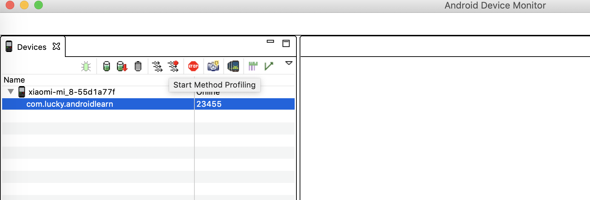
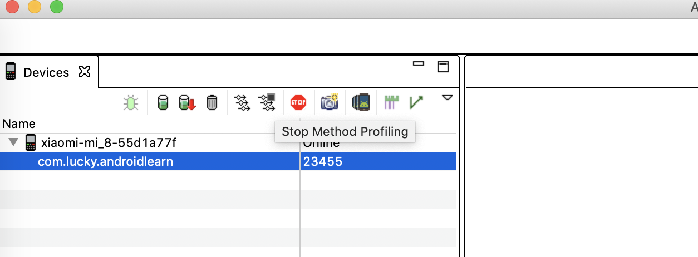
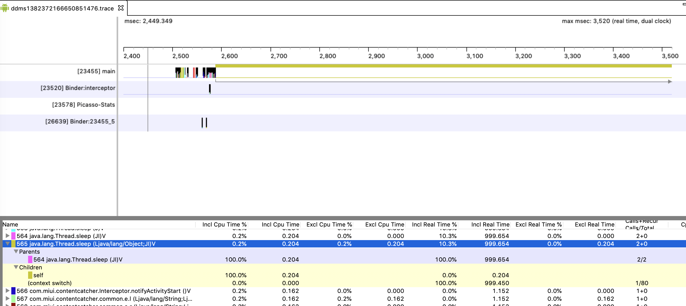
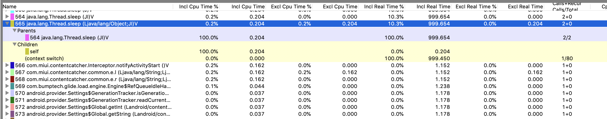
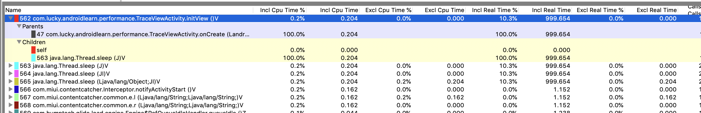
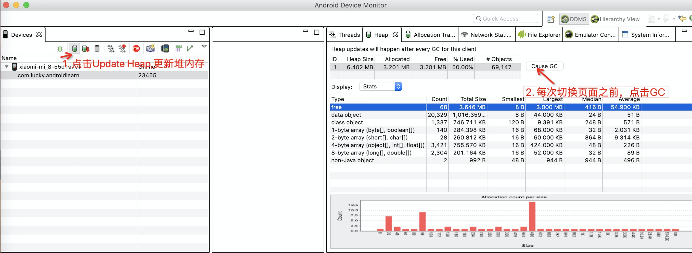
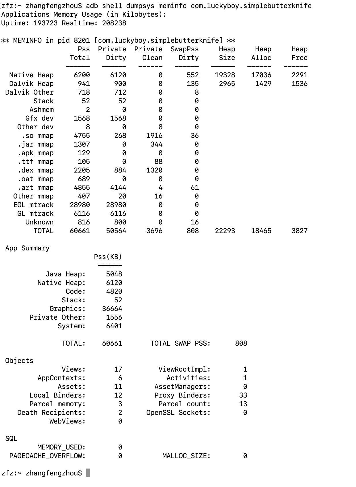

- [内存优化](#内存优化)
  - [内存问题产生原因](#内存问题产生原因)
    - [1. 内存优化的初衷：](#1-内存优化的初衷)
    - [2. 内存泄漏](#2-内存泄漏)
      - [1. 静态的（方法区）](#1-静态的方法区)
      - [2. 栈式的（Java虚拟机栈）](#2-栈式的java虚拟机栈)
      - [3. 堆式的 (自由存储区域)](#3-堆式的-自由存储区域)
    - [3. 内存回收](#3-内存回收)
      - [1. StrongReference 强引用](#1-strongreference-强引用)
      - [2. SoftReference 软引用](#2-softreference-软引用)
      - [3. WeakReference 弱引用](#3-weakreference-弱引用)
      - [4. PhatomReference 虚引用](#4-phatomreference-虚引用)
    - [4. 内存泄漏](#4-内存泄漏)
      - [1. 内存泄漏导致的问题](#1-内存泄漏导致的问题)
      - [2. 类加载的开始分配内存，类卸载的时候释放内存](#2-类加载的开始分配内存类卸载的时候释放内存)
        - [1. 静态变量](#1-静态变量)
        - [2. 非静态内部类（包括匿名内部类）](#2-非静态内部类包括匿名内部类)
      - [3. 监听未移除](#3-监听未移除)
      - [4. 资源未关闭](#4-资源未关闭)
      - [5. 无限循环动画](#5-无限循环动画)
  - [内存优化手段](#内存优化手段)
    - [TraceView](#traceview)
    - [HeapDump](#heapdump)
    - [AllocationTracker](#allocationtracker)
    - [MAT](#mat)
    - [LeakCanary](#leakcanary)
## 内存优化
### 内存问题产生原因
#### 1. 内存优化的初衷：
1. 如何优化自己的已有项目，运行更加流畅
2. 从新开始新的项目 如何更好的开车 

#### 2. 内存泄漏
准所周知，C/C+自己分配和释放内存，C通过malloc来申请内存，free来释放内存。C++通过new来申请内存，delete来释放内存，这些都要通过程序员自己来手动调用来完成这些操作。而Java语言就不需要考虑这些，因为有Java虚拟机的存在，会自动的为我们处理这里操作，但是不管是C/C++或者是Java都会面临一个问题，内存泄漏。那么什么是内存泄漏？

在Java语言中内存泄漏意思就是，内存不在GC掌控之内了，当一个对象已经不再需要使用了，本应该被回收时，而又有另外一个正在使用的对象持有它的引用从而就导致了该对象不能回收。这种导致了本该被回收的的对象却不能被回收继而停留在堆内存中，就产生了内存泄漏。

Java的GC内存回收机制：某对象不再有任何的引用的时候才会进行回收。

ArrayList<String> list = new ArrayList();

内存分配的几种策略
##### 1. 静态的（方法区）
   静态的存储区：内存在程序编译的时候已经分配好，这块的内存在程序整个运行期间
   都一直存在。它主要存放静态数据, 全局的static数据和一些常量。
      
##### 2. 栈式的（Java虚拟机栈）
   在执行函数(方法)时， 函数一些内部变量的存储都可以放在栈（栈帧）上面创建，函数执行结束的
   时候这些存储单元就会自动被释放掉。
   栈内存包括分配的运算速度很快，因为内置在处理器里面的，当然容量有限。

##### 3. 堆式的 (自由存储区域)
   也叫动态内存分配，有时候可以用malloc或者new来申请分配一个内存，在C/C++可能
   需要自己负责释放（java里面直接依赖GC）
   在C/C++这里是可以自己掌控内存的，需要有很高的素养来解决内存问题。java在这块
   貌似程序员没有很好的方法来解决内存的问题。
      
栈和堆的区别：
堆是不连续的内存区域，堆空间比较灵活也特别大。
栈是一块连续的内存区域，大小是由操作系统决定的。

堆管理很麻烦，频繁的new/remove会造成大量的内存碎片，
这样就会慢慢导致效率低下。
对于栈的话， 它先进后出，进出完全不产生碎片，运行效率高且稳定。

```java
public class main {
   int a = 1; // a 堆中
   Student s = new Student();// 堆中
   public void xxx() {
      int b = 1; // b 存储于栈里面
      Student s2 = new Student();
   }
}
```

1. 成员变量全部存储于堆中（包括基本数据类型，引用和引用的对象实体）
-- 因为他们属于类，类对象最终还是被new出来的。
2. 局部变量的基本数据类型和引用存储于栈中，引用的对象实体存储在堆中。
-- 因为他们属于方法中的变量，生命周期会随着方法一起结束

我们讨论内存泄漏 讨论的就是堆内存的问题 栈内存不要考虑
#### 3. 内存回收
特殊的java类，利于回收

##### 1. StrongReference 强引用
  回收时机：从不回收 使用：对象的一般保存生命周期，JVM停止的时候才会终止

##### 2. SoftReference 软引用
  回收时机： 当内存不足的时候，使用：SoftReference<String> 结合ReferenceQueue构造 有效期短    
  生命周期：内存不足时终止

##### 3. WeakReference 弱引用
   回收时机： 在垃圾回收的时候，使用同软引用，生命周期：GC终止

##### 4. PhatomReference 虚引用
   回收时机：在垃圾回收的时候；使用结合ReferenceQueue来跟踪对象被垃圾回收器回收的的活动，生命周期：GC终止。
   随时都有可能被干掉。
   
开发时，为了防止内存溢出，处理一些比较占用内存大并且生命周期长的对象的时候，可以尽量使用软引用和弱引用。

软引用比LRU算法更加任性，回收量是比较大的，你无法控制哪些对象。
   
比如使用场景：默认头像， 默认图标
ListView 或者GridView, RecyclewView要使用内存缓存+外部缓存（SD卡）

#### 4. 内存泄漏
内存泄漏经常出现的场景
##### 1. 内存泄漏导致的问题
内存泄漏会导致内存泄漏和内存溢出的问题

内存泄漏（MemoryLeak）
   进程中某些对象已经没有使用价值了，但是他们还是可以直接或者间接的被引用到
   GCRoot 导致无法回收。当内存泄漏过多的时候，在加上应用本身占用的内存，最终
   就会导致内存溢出OOM.

内存溢出（OOM）
   当应用占用的heap资源超过了Dalvik虚拟机分配的内存就会内存溢出，比如加载大图片
      
##### 2. 类加载的开始分配内存，类卸载的时候释放内存   
内存泄漏常见错误写法场景

###### 1. 静态变量
当调用getInstance时，如果传入的context是Activity的Context.只要这个单例没有被释放，那么Activity就是一直不释放，直到进程结束。
###### 2. 非静态内部类（包括匿名内部类）
非静态内部类（包括匿名内部类）引起内存泄漏，内部类持有外部类的变量 则会造成内存泄漏 隐式持有MainActivity实例， MainActiity.this.a

解决方案：
将非静态内部类修改为静态内部类（静态内部类不会隐式的持有外部类）

加上static 里面的匿名内部类就变成了静态匿名内部类
   
mHandler是匿名内部类的实例 会引用外部对象MainActivity.this,
   
解决方案：
将匿名内部加上static变成静态匿名内部类
有时候确实会有这样的需求，需要引用外部类的资源，怎么办？这时可以修改构造方法，持有一个外部类的强引，但是会内存泄漏
解决方法，设置软引用保存，当内存一发生GC的时候，就会回收。
```java
WeakReferen<Actiity> mainAcitity = new WeakReference<Activity>(activity);
Actiity activity = mainAcitity.get();   
```   
当使用软引用或者弱引用的时候，MainActivity难道很容易或者可以被GC回收吗？
GC回收的机制是什么？当MainActivity不被任何的对象引用
虽然Handler里面用的是软引用、弱引用 但是并不意味者不存在其他的对象引用
该MainAcitiy, 我连MainActivity都被回收了，那Handler也就没玩的了 就是没什么作用了 也是GC就可以回收Activity了
   
##### 3. 监听未移除
比如广播，或者其他自定义的Listener, 因为这些监听一般都会持有外部类的引用，这样很容易造成内存泄漏，所以需要反注册。 
##### 4. 资源未关闭
比如BroadCastReceiver Cursor Bitmap IO流 自定义属性attribute，当不需要是使用的时候，要记得及时释放资源 否则就是内存泄漏
##### 5. 无限循环动画
没做在Activity 的OnDestroy的时候没有结束掉，否则Activity就会变成泄漏对象

### 内存优化手段
#### TraceView
在SDK的Tools目录下，点击Monitor, 我们看到如下图：


首先点击startMethodTracing, 然后进入想要测试的页面，等待几秒，一般不超过5秒，然后点击stopMethodTracing, 如下图所示


接着就会看到如下的分析结果


左侧的main,Binder等都是对应的线程，右侧是每个线程对应的时间线上的每个方法的执行时间区间，包括开始时间和结束时间，拖拽放大之后，可以看到是不同的色块，一个色块表示的就是一个方法，整个方法呈一个U字型，U字型的左侧表示方法的开始，右侧表示的是方法的结束，中间表示方法的执行过程。由此可以得知，如果色块的长度越长，表示该方法执行的时间越长，这个方法就越值得我们关注。
下面演示是如何找到具体是哪个方法执行时间过程的流程

如上图所示，鼠标点击方法的左侧，就会在下面的方法区域定位到具体的执行方法，我们可以和时间轴上的方法对上，但是这个方法不是我们自己的代码，需要定位，我们可以点击该方法的parents, 最终就会定位到我们所写的具体代码，initView方法。





#### HeapDump
HeapDump感觉只能用于定性，是否某个页面发生了内存泄漏，但是定位不到具体的位置，操作如下：


如上图所示，在每次切到目标页面前，都进行一次GC，然后再进入页面，反复几次，如果Allocated这个指标在不断的增大，则很明显，有对象是没有被GC掉的，此页面存在内存泄漏，反之，这个指标一直维持在一个稳定的状态，则表明该页面正常。
#### AllocationTracker
```console
// 查看该运行中的apk的内存信息
adb shell dumpsys meminfo com.luckyboy.simplebutterknife 
```


可以反复进出有怀疑有内存泄漏的页面，可以尝试多次，然后再次执行该命令，对比前后两次的变化，如果某个类型的对象比正常预期的多（正常情况下应该是被回收了的，该类型的对象个数保持稳定），那么就可能存在内存泄漏问题。
#### MAT
MAT是Eclipse出品的内存分析工具，下载地址 [https://www.eclipse.org/mat/downloads.php](https://www.eclipse.org/mat/downloads.php)

在Android中，我们可以利用Monitor中的Dump HPROF file （带红色向下箭头的绿桶）来产生一段时间内的内存分配情况，如下图：


获取该文件后，不能在MAT中直接使用，需要转换，利用命令行
> zfz:Desktop zhangfengzhou$ hprof-conv love1.hprof ha.hprof

love1.hprof是上面操作生成的文件，ha.hprof文件是转化后的文件

利用MAT打开hprof文件


#### LeakCanary


