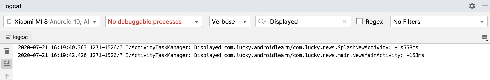
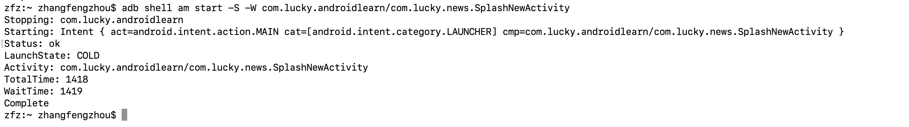
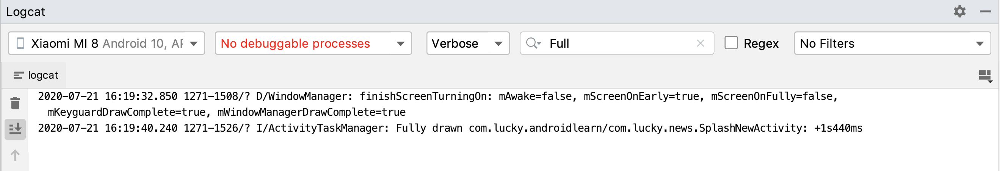
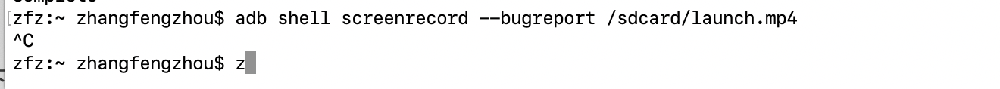

- [App启动优化](#app启动优化)
  - [App启动分类](#app启动分类)
  - [App启动优化手段](#app启动优化手段)
    - [1. 设置背景图片](#1-设置背景图片)
    - [2. 设置背景透明](#2-设置背景透明)
  - [App的冷启动优化](#app的冷启动优化)
  - [App的启动时间测试](#app的启动时间测试)
    - [1. Displayed 查看初始显示的时间方法一](#1-displayed-查看初始显示的时间方法一)
    - [2. adb shell 查看初始显示的时间方法二](#2-adb-shell-查看初始显示的时间方法二)
    - [3. Full Drawn 查看完全的显示时间方法一](#3-full-drawn-查看完全的显示时间方法一)
    - [4. screenrecord 查看完全的显示时间方法二](#4-screenrecord-查看完全的显示时间方法二)
## App启动优化
App启动优化是一个比较常见的问题，特别在冷启动，由于在初始化应用进程的过程中，WindowManager会先加载App里的主题样式里的窗口背景（WindowMBackground）作为预览元素，然后才会真正的加载布局，如果这个时间过长，而默认的背景又是黑色或者白色，这样就会给用户造成一种卡顿的感觉，很不流畅，影响用户体验。这个就突出了App启动优化的必要性。
### App启动分类
App启动优化首先要考虑两个概念，一个是冷启动，一个是热启动。冷启动就是一个应用进程从无到有的过程，一般的操作过程就是用户选择清除应用或者开机之后，点击桌面应用图标，然后就从Zygote进程Fork出来一个新的进程的过程，然后创建和初始化Application类，在创建和初始化MainActivity类（包括一系列的测量，布局，绘制），最后显示到界面上。热启动就是用户将应用进程切换到后台，或者按Back键退出应用，但是应用并没有被杀死，这个时候在点击应用图标，就不会重新创建应用进程，也不会在重新创建Application，只是初始化MainActivity类（包括一系列的测量，布局，绘制），最后显示到界面上。
### App启动优化手段
#### 1. 设置背景图片
在样式的windowBacakgroud属性中设置图片
```java
//res/values/styles.xml
<style name="SplashTheme" parent="AppTheme">
    <item name="windowNoTitle">true</item>
    <item name="windowActionBar">false</item>
    <item name="android:windowBackground">@drawable/splash</item>
</style>

<!-- AppTheme -->
<style name="AppTheme" parent="Theme.MaterialComponents.Light.NoActionBar">
    <item name="colorPrimary">@color/colorPrimary</item>
    <item name="colorPrimaryDark">@color/colorPrimaryDark</item>
    <item name="colorAccent">@color/colorAccent</item>
    <item name="materialButtonStyle">@style/materialButton</item>
    <item name="android:windowContentTransitions">true</item>
    <item name="android:windowActivityTransitions">true</item>
    <item name="android:windowAllowEnterTransitionOverlap">false</item>
    <item name="android:windowAllowReturnTransitionOverlap">false</item>
</style>

//res/drawable/splash.xml
<?xml version="1.0" encoding="utf-8"?>
<layer-list xmlns:android="http://schemas.android.com/apk/res/android">
    <item>
        <shape android:shape="rectangle">
            <solid android:color="@android:color/white"/>
        </shape>
    </item>
    <item android:gravity="center">
         <bitmap android:src="@drawable/icon_splash"/>
    </item>
</layer-list>

//AndridManifest.xml
<activity
     android:name="com.luckyboy.ppd.PPDMainActivity"
     android:theme="@style/SplashTheme">
     <intent-filter>
         <action android:name="android.intent.action.MAIN" />
         <category android:name="android.intent.category.LAUNCHER" />
     </intent-filter>
     <intent-filter>
         <action android:name="android.intent.action.VIEW" />
     </intent-filter>
</activity>
```
#### 2. 设置背景透明
```java
//res/values/styles.xml
//1.设置背景透明
<style name="SplashThemeNew" parent="android:Theme.Translucent.NoTitleBar.Fullscreen"/>
//2.应用透明主题
<activity
    android:name="com.lucky.news.SplashNewActivity"
    android:theme="@style/SplashThemeNew">
    <intent-filter>
        <action android:name="android.intent.action.MAIN" />
        <category android:name="android.intent.category.LAUNCHER" />
    </intent-filter>
    <intent-filter>
        <action android:name="android.intent.action.VIEW" />
    </intent-filter>
</activity>
//3.在Activity中恢复原有的主题
public class SplashNewActivity extends Activity {
    @Override
    protected void onCreate(@Nullable Bundle savedInstanceState) {
        super.onCreate(savedInstanceState);
        setTheme(R.style.AppTheme);
        if (Build.VERSION.SDK_INT >= Build.VERSION_CODES.LOLLIPOP) {
            getWindow().clearFlags(WindowManager.LayoutParams.FLAG_TRANSLUCENT_STATUS);
            getWindow().getDecorView().setSystemUiVisibility(View.SYSTEM_UI_FLAG_LAYOUT_FULLSCREEN 
            | View.SYSTEM_UI_FLAG_LAYOUT_STABLE);
            getWindow().addFlags(WindowManager.LayoutParams.FLAG_DRAWS_SYSTEM_BAR_BACKGROUNDS);
            getWindow().setStatusBarColor(Color.TRANSPARENT);
        }
        setContentView(R.layout.activity_splash_new);
        ImageView ivSplash = findViewById(R.id.iv_splash);
        String url = "https://c-ssl.duitang.com/uploads/item/201912/10/20191210095337_3ZmyK.jpeg";
        Glide.with(this).load(url).crossFade(1000).into(ivSplash);
        new Handler().postDelayed(()->{
            startActivity(new Intent(SplashNewActivity.this, NewsMainActivity.class));
            finish();
            overridePendingTransition(R.anim.anim_right_in, R.anim.anim_left_out);
        }, 2000);
    }
}
```
### App的冷启动优化
在前面的理论实践中，我们知道在冷启动的时候会创建和初始化Application对象和Activity对象，以及经过onAttachBaseContext(),onCreate(),onResume()这些方法之后才会对用户可见，所以在这些过程中，尽量不要出现一些耗时操作，在Application中尽量少用使用静态变量，在启动Activity中，尽量减少布局的层次结构和复杂度。一些耗时操作放到异步任务中，比如Callable, 其次，SharePreference的初始化会将其中的所有数据读取到内存中，所以这个初始化过程放到主线程中不合适，反而会延迟应用的启动速度，所以放在异步线程中比较好。
### App的启动时间测试
#### 1. Displayed 查看初始显示的时间方法一


后面的时间表示的是进行启动到第一次页面绘制完成所需要的所有时间。它并不包括不被布局文件及初始化对象所引用的资源的加载时间，因为这个加载是一个内部过程，不阻塞应用初始内容的显示。

#### 2. adb shell 查看初始显示的时间方法二


totalTime表示的启动到页面显示的总时间

#### 3. Full Drawn 查看完全的显示时间方法一


需要在Activity中添加代码才能在日志中找到对应的日志，否则是没有日志的
```java
//SplashNewActivity.java
try {
    reportFullyDrawn();
} catch (Exception e) {
    e.printStackTrace();
}
```
你可以使用 reportFullyDrawn() 方法来测量应用启动到所有资源和视图层次结构的完整显示之间所经过的时间，该方法在应用使用延迟加载的情况下是很有用的。

在延迟加载时，应用在初始的绘图之后，异步加载资源，然后更新视图。如果由于延迟加载，应用的初始显示并不包括所有的资源，你可能会考虑将所有的资源和视图的完全加载和显示作为一个单独的指标。例如：你的用户界面可能已经完成了文本的加载，但又必须从网络获取图像。

为了解决这个问题，你可以手动调用reportFullyDrawn()，让系统知道你的 Activity 完成了它的延迟加载。当您使用此方法，logcat 将显示出从创建应用对象到调用 reportFullyDrawn() 方法的时间。

#### 4. screenrecord 查看完全的显示时间方法二

这种录屏的方式在视频的左上角会有个时间戳，视频可以通过逐帧播放的播放器进行播放，我们可以以点击图标变色的时间点为开始时间，以任何你想结束的时间为结束点，计算出时间差，就是显示所需要的时间，个人感觉不好用。


